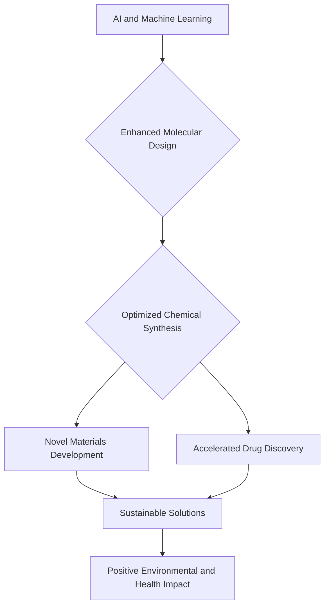

## Chemistry in 2026: AI Accelerates Discovery, Sustainability Takes Center Stage

As of September 2026, the world of chemistry is buzzing with transformative advancements, largely driven by the synergy of artificial intelligence and an urgent global focus on sustainability. Researchers are leveraging cutting-edge computational power to redefine how new molecules are designed and synthesized, while simultaneously pioneering innovative solutions for a greener future.

One of the most significant developments is the increasing role of AI and machine learning in **accelerated drug discovery and molecular design**. These computational tools are dramatically speeding up the identification of promising drug candidates and optimizing chemical reactions, enabling chemists to explore vast chemical spaces with unprecedented efficiency. This shift promises to bring new therapeutics to market faster and more cost-effectively.

Parallel to this, the push for **sustainable chemistry** is yielding tangible results. Breakthroughs in areas like biodegradable plastics, advanced carbon capture and conversion technologies, and sustainable catalysis are reshaping industries. For instance, new electrochemical processes can now transform common plastics into high-purity hydrogen, addressing both waste management and clean energy needs. Similarly, efforts are concentrated on developing greener manufacturing processes, such as sustainable electrochemical synthesis for pharmaceuticals, to reduce waste and reliance on toxic reagents. The focus is on creating functional materials that are environmentally benign throughout their lifecycle, from production to disposal.

These interlinked areas highlight a powerful trajectory for chemistry in the mid-2020s: a future where intelligent design meets environmental responsibility, paving the way for a healthier planet and more advanced human well-being.

