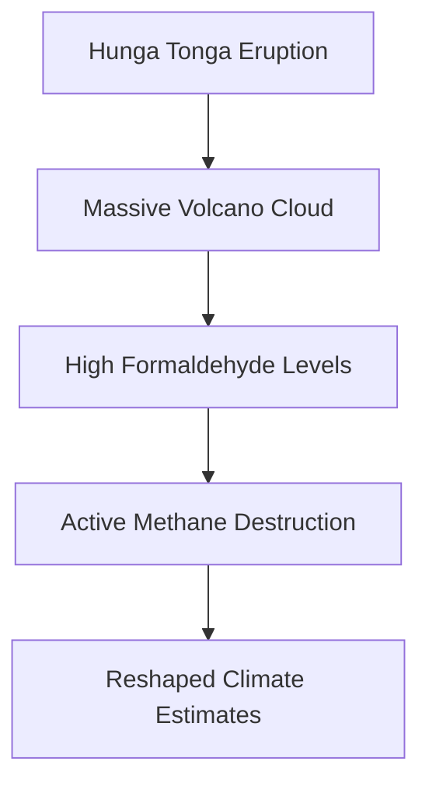

### Volcanic Eruption Sparks Unexpected Methane Destruction: A Climate Game Changer?

Just days ago, scientists unveiled a remarkable discovery that could reshape our understanding of atmospheric chemistry and climate change. New research suggests that the colossal cloud from the 2022 Hunga Tonga-Hunga Ha'apai underwater volcanic eruption may have inadvertently triggered chemical reactions capable of actively destroying methane in the atmosphere.

Methane is a powerful greenhouse gas, significantly contributing to global warming. Historically, its atmospheric breakdown mechanisms have been well-studied, but this volcanic influence introduces a fascinating new variable. Researchers detected exceptionally high levels of formaldehyde, a tell-tale chemical fingerprint, within the massive volcano cloud. Formaldehyde is a brief intermediate in the reactions that break methane apart, indicating that active methane destruction was taking place.

This surprising finding, published just this week, suggests a novel pathway for the removal of a potent greenhouse gas. The implications are profound: it could lead to a significant re-evaluation of methane pollution estimates and potentially inspire entirely new methods for slowing near-term global warming. The complex interplay between geological events and atmospheric composition continues to surprise, highlighting the intricate natural balances that govern our planet's climate.

