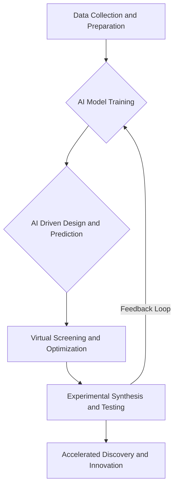

## Chemistry's AI Revolution: Accelerating Discovery in 2026

As of September 2026, the field of chemistry is experiencing an unprecedented surge in innovation, largely propelled by the integration of Artificial Intelligence (AI). This era marks a significant shift from traditional, often laborious, discovery processes to AI-accelerated approaches, fundamentally reshaping drug development and materials science.

AI is no longer just a supporting tool but a core component, transforming how molecules are designed, reactions are predicted, and materials are conceived. In drug discovery, AI-driven platforms are making molecular design faster and more predictive, allowing for earlier target identification and reducing late-stage failures. This intelligent approach allows scientists to interrogate vast biological datasets and explore previously inaccessible chemical spaces, significantly cutting down research and development timelines and costs.

Similarly, materials science is leveraging AI to predict optimal compositions and structures for novel materials, speeding up discovery dramatically compared to traditional trial-and-error methods. From self-healing infrastructure to next-generation batteries and aerospace composites, AI is instrumental in developing materials with enhanced properties for diverse applications. The convergence of chemistry and computer science is creating self-driving laboratories where AI algorithms propose experiments, and automated equipment carries them out, further accelerating the pace of innovation.

This AI-driven paradigm promises not only faster breakthroughs but also more sustainable and efficient solutions across industries, from healthcare to energy and manufacturing.

