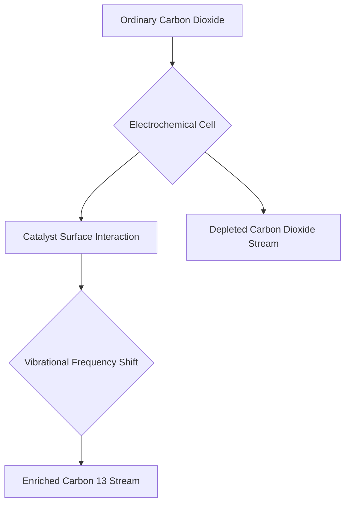

**Chemistry's Latest Breakthrough: Sifting Carbon-13 from CO2 with Vibrational Fingerprints**

Today, September 25, 2026, marks an exciting development in chemistry, with scientists reporting a revolutionary method to enrich carbon-13 directly from ordinary carbon dioxide. This breakthrough, driven by a team of chemists in China, promises to democratize access to this critical isotope, which is vital across various scientific fields.

Traditionally, separating carbon isotopes like carbon-13 from the more abundant carbon-12 has been a complex and energy-intensive process, often relying on massive distillation columns. However, the new approach utilizes an electrochemical cell that operates efficiently at room temperature. The ingenious aspect of this method lies in exploiting subtle differences in how a catalyst surface reshapes the vibrational frequencies of the carbon dioxide molecules it interacts with, rather than relying solely on mass differences.

The experimental results are remarkable: a nitrogen-doped tin catalyst in a flow cell converted ordinary carbon dioxide, which naturally contains about 1.1% carbon-13, into an output stream boasting over 14.0% carbon-13—a thirteen-fold concentration. This continuous process maintains high performance even when scaled up, demonstrating its potential beyond laboratory curiosities.

This electrochemical isotope separation could have far-reaching implications. Carbon-13 metabolic flux analysis is a cornerstone in cancer biology, helping researchers understand how tumor cells metabolize nutrients. It's also indispensable for tracer studies in drug development, environmental science, and clinical diagnostics, where demand for the isotope has been steadily climbing. By offering a cheaper, more accessible method for carbon-13 enrichment, this technology could accelerate research and innovation in these critical areas, moving away from the need for colossal distillation columns.

