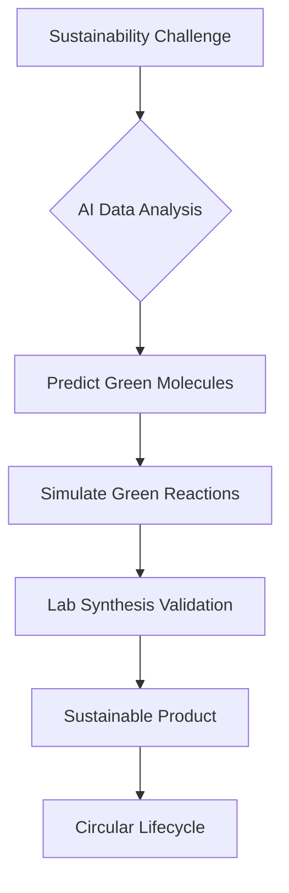

## Chemistry in 2026: AI Accelerates the Green Revolution

As of October 3, 2026, the world of chemistry is buzzing with transformative progress, largely driven by the symbiotic relationship between artificial intelligence (AI) and the imperative for sustainable solutions. The integration of AI tools is not just enhancing research; it's fundamentally reshaping how chemists approach material design, reaction planning, and environmental challenges.

One of the most significant themes emerging in late 2025 and continuing into 2026 is the profound impact of AI on accelerating discovery in sustainable chemistry and advanced materials. AI-powered platforms are now routinely used to predict molecular properties, optimize synthetic pathways, and design novel compounds with unprecedented speed and accuracy. This capability is crucial for developing everything from new, more efficient catalysts for renewable energy to advanced polymers for a circular economy. For instance, researchers are leveraging AI to design "reactionware" for customized reactions, which can lead to reduced manufacturing costs and faster prototyping, especially in drug development and miniature chemical plants. The American Chemical Society's 2026 Green Chemistry Challenge Awards recently honored innovations spanning recyclable polyurethanes, cleaner pharmaceutical manufacturing, and sustainable crop protection, all areas where AI is increasingly playing a supportive role in optimizing processes and identifying greener alternatives.

The drive towards a truly circular economy is also gaining significant momentum, with new breakthroughs in polymer upcycling and bio-based chemicals. Companies are launching breakthrough plant-based technologies like RE:CHEMISTRY, which transform everyday products into safer and more sustainable alternatives by replacing fossil-based ingredients. Policy frameworks are also being developed to incentivize businesses to scale these sustainable chemical solutions, recognizing the critical need for government support to unlock investment and market adoption.

The rapid evolution of computational chemistry, quantum modeling, and machine learning is revolutionizing how molecules and materials are designed, allowing for the prediction of molecular behavior and material properties with exceptional precision before experimental validation. This synergistic approach, where AI tackles complex data and accelerates the iterative design process, is proving essential in tackling global challenges from climate change to resource scarcity.

Here's a simplified look at how AI is driving sustainable material discovery:

The future of chemistry in 2026 is undoubtedly green, intelligent, and interconnected, with AI acting as a powerful catalyst for a sustainable tomorrow.