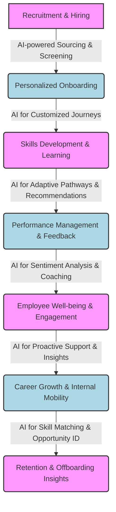

## The AI-Powered HR Revolution: Enhancing Employee Experience, Not Just Efficiency

**Date:** October 26, 2023

The conversation around Artificial Intelligence in HR has rapidly evolved from automating mundane tasks to strategically enhancing the entire employee experience (EX). It's no longer just about cutting costs or streamlining processes; it's about leveraging AI to create a more personalized, engaging, and human-centric workplace.

Employees, conditioned by consumer-grade digital experiences, expect similar personalization and efficiency from their employers. This is where AI steps in as a powerful ally for HR leaders. By analyzing vast amounts of data, AI can offer bespoke learning paths, intelligent onboarding flows, proactive well-being support, and even sentiment analysis to predict disengagement before it escalates. The goal is to move beyond one-size-fits-all solutions and deliver truly individualized support at scale.

This strategic shift means HR professionals are increasingly becoming orchestrators of intelligent systems, using insights from AI to make more informed decisions, design better programs, and free up time for high-touch human interactions where they matter most. From identifying skill gaps to fostering internal mobility, AI empowers HR to act as a genuine strategic partner in business success and employee development.

Of course, the journey isn't without its considerations. Ethical AI usage, data privacy, algorithmic bias, and the need for continuous human oversight remain paramount. The future of HR is not about replacing humans with machines, but about augmenting human capabilities with intelligent technology to build more resilient, agile, and employee-focused organizations.

*Above: A high-level flow illustrating AI's integration across the employee lifecycle to enhance experience and efficiency.*