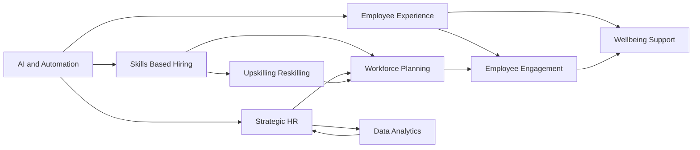

## HR in 2026: Navigating the Human-Machine Era

As of May 4, 2026, the HR landscape is in constant motion, evolving at an unprecedented pace. Organizations are at a critical juncture, facing compounded pressures from technological advancements, shifting workforce expectations, and the ongoing demand for agility. HR leaders are no longer merely administrative; they are strategic orchestrators guiding businesses through continuous transformation, balancing human needs with business resilience.

Here's a look at the actual live trends shaping human resources right now:

**1. The Rise of Agentic AI and Automation.** Artificial Intelligence is no longer a future concept but a central component of Human Capital Management (HCM) systems, moving beyond basic automation to "Agentic AI" that understands context and supports smarter decision-making. This technology is revolutionizing recruitment, performance management, and employee experience by streamlining tasks, providing personalized support, and enabling data-driven insights. HR and IT alignment is crucial to navigate compliance and build effective data environments for these AI initiatives.

**2. Skills-Based Hiring Takes Center Stage.** The traditional resume is losing its influence. Employers are rapidly shifting towards skills-based hiring and competency models, prioritizing what candidates can *do* over degrees or past job titles. This approach expands talent pools, improves hiring quality, and fosters internal mobility by focusing on transferable skills and continuous upskilling and reskilling to address evolving skill gaps.

**3. Enhanced Employee Experience and Well-being.** Employee well-being, including mental fitness, is a board-level risk and a core business priority. Organizations are affirming their commitment to holistic employee support, with a focus on comprehensive wellness programs, equitable flexibility, and creating workplaces that feel more like communities. The pressure on employees to do "more with less" has accumulated, and simplification of the employee experience is becoming key to sustainable performance.

**4. HR as a Strategic Business Driver.** HR's role is shifting from a support function to a strategic operator, leveraging data and analytics to align people strategies with overarching business goals. Data-driven decision-making and a focus on measurable impact are becoming core competencies, enabling HR to proactively anticipate issues and drive organizational transformation.

The future of work in 2026 is intentionally designed with clarity and genuine empathy, where HR acts as a pathfinder, helping people stay steady amidst accelerating disruption.

