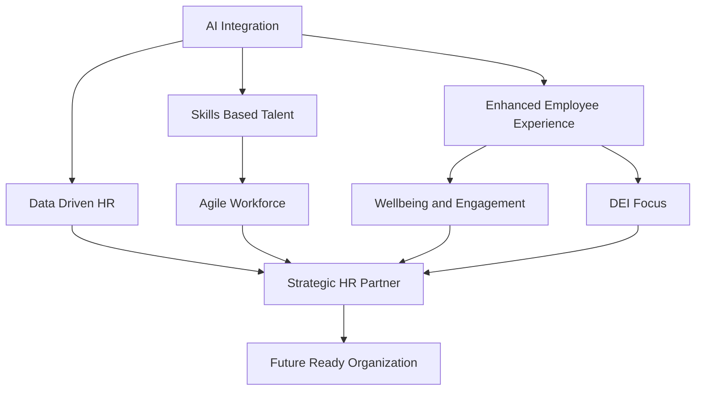

## HR's New Horizon: Key Trends Shaping the Workforce in May 2026

As of May 2026, the HR landscape is dynamically reshaping, driven by rapid technological advancements and evolving workforce expectations. The focus is increasingly on strategic contributions, human-centric approaches, and leveraging data for informed decision-making. Here's a look at the actual live news in HR trends right now.

**AI's Ascendancy in HR Operations.** Artificial intelligence (AI), particularly "Agentic AI," is no longer a futuristic concept but a central component of Human Capital Management (HCM) systems. Organizations are adopting AI to automate onboarding, streamline payroll processes, generate insights from HR data, and enhance candidate screening. The goal is to move beyond simple automation to proactive task completion, freeing HR professionals for more strategic roles. The ethical integration of AI, including transparency in algorithms and fostering AI literacy, remains crucial to ensure a human-centered approach.

**The Shift to Skills-Based Talent Strategies.** There's a profound move away from traditional credentials like degrees and job titles towards a skills-first approach in hiring, development, and internal mobility. This strategy broadens talent pools, addresses skill gaps, and prepares employees for evolving roles through continuous upskilling and reskilling programs. Companies are leveraging AI and analytics to identify, map, and develop the critical capabilities needed for the future workforce.

**Prioritizing Employee Experience and Well-being.** With worker expectations higher than ever, organizations are doubling down on creating engaging and supportive employee experiences. This includes a significant focus on employee well-being and mental health, with burnout becoming a boardroom-level risk. Companies are implementing comprehensive wellness programs and fostering psychological safety, recognizing that a healthy, engaged workforce is key to productivity and retention. Equitable flexibility and inclusive work environments are also paramount, with some organizations even exploring four-day workweeks.

**HR as a Strategic Business Partner.** HR is solidifying its role as a strategic operator, moving from a support function to a guide in organizational evolution. CHROs are prioritizing AI transformation, workforce redesign, mobilizing leaders for growth in uncertainty, and embedding organizational culture to drive performance. This strategic pivot requires HR leaders to be agile, data-driven, and capable of balancing rapid technological change with human-centered strategies.

**Data-Driven Decisions and Integrated HR Technology.** The increasing complexity of HR demands a robust, data-driven approach. Organizations are investing in integrated HR technology platforms that offer full-funnel visibility, automate workflows, and provide real-time analytics and predictive insights. This enables HR to track key metrics, prove ROI on hiring investments, and make more informed decisions that align with business outcomes. The collaboration between HR and IT is becoming critical to build effective data environments that support advanced AI initiatives and ensure compliance.

Here is a visual representation of these interconnected HR trends:

In summary, HR in May 2026 is characterized by a dynamic interplay of advanced technology, a laser focus on human potential, and an elevated strategic position within organizations. Success hinges on embracing innovation while safeguarding trust and fostering a people-first culture.