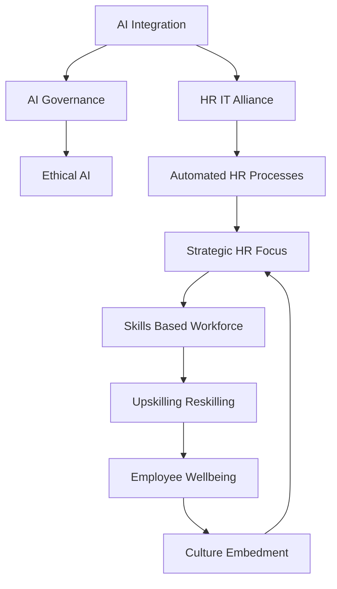

## Navigating Tomorrow: Live HR Trends Shaping 2026

As of May 2026, the HR landscape is dynamically evolving, pushing people leaders to embrace innovation while prioritizing the human element. The days of HR as a purely administrative function are long gone; today, it stands as a strategic imperative, driving organizational resilience and growth. Here's a look at the actual live trends defining our present and future work environments.

**AI Revolutionizes HR Operations and Strategy**
Artificial intelligence is no longer a futuristic concept but a present-day reality profoundly reshaping HR. From automating routine tasks like screening and scheduling to supporting complex workforce planning with agentic AI, its influence is pervasive. This shift necessitates a strong alliance between HR and IT to ensure secure, scalable, and compliant systems. Organizations are focused on crafting clear, HR-focused AI strategies, understanding that AI's impact extends beyond efficiency to redefining roles and expectations. The ethical deployment and governance of AI in employment decisions are also critical concerns, with countries beginning to regulate its use.

**The Rise of the Skills-Based Workforce**
The traditional reliance on job titles and degrees is giving way to a skills-first approach. Companies are increasingly reassessing their skills inventories and focusing on capabilities rather than just qualifications. This trend is driven by the rapid evolution of job requirements, with some reports indicating that a significant percentage of current job skills will change by 2030. Embracing skills-based hiring and fostering robust upskilling and reskilling programs are essential for talent attraction, internal mobility, and long-term organizational agility.

**Prioritizing Employee Wellbeing and Experience**
Employee wellbeing has ascended to a board-level risk, moving beyond a "nice-to-have" benefit to a measurable business priority. This includes a heightened focus on psychological health, burnout prevention, and creating human-centric workplaces. As work intensifies and AI integrates further, time is becoming one of the most valued currencies for employees, leading organizations to experiment with greater flexibility and protected time for deep work. Continuous listening strategies are replacing annual engagement surveys to better understand and respond to employee needs in real time.

**Strategic HR and Culture as a Performance Driver**
HR is undeniably moving from a support function to a strategic operator, guiding organizations through continuous change. CHROs are prioritizing initiatives to embed desired organizational culture into employees' daily work, recognizing its direct link to performance. Furthermore, empathetic leadership is crucial in the digital era, as AI handles more routine tasks, emphasizing the value of emotional intelligence, adaptability, and communication skills in managers.

The HR profession in 2026 is at the nexus of technology, talent, and human connection, demanding agility, foresight, and a deeply human-centered approach to lead organizations through an era of continuous transformation.

