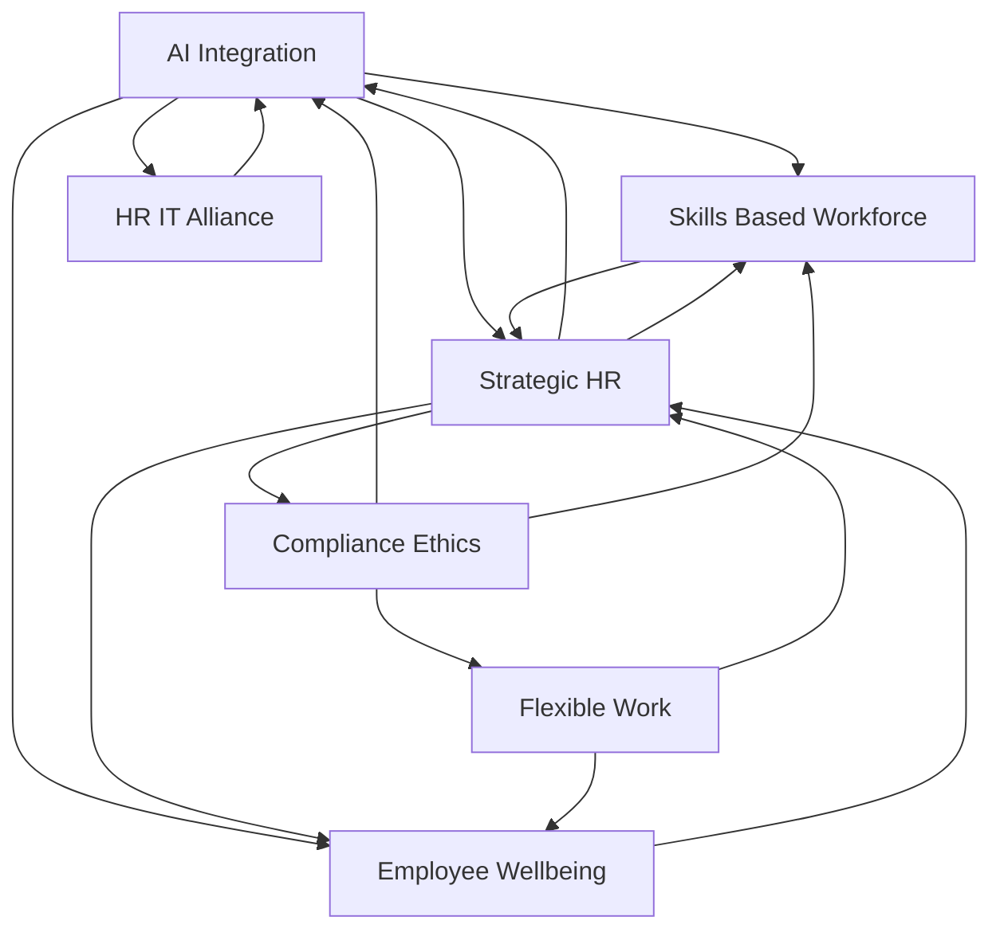

## Navigating Tomorrow: Live HR Trends in May 2026

As of May 2026, the HR landscape continues its dynamic evolution, driven by technological advancements, evolving workforce expectations, and a renewed focus on human-centric strategies. HR leaders are firmly positioned at the nexus of people, technology, and business strategy, moving beyond traditional administrative roles to become true strategic operators.

**AI Transforms Every Facet of HR**
Artificial Intelligence is no longer a futuristic concept but a tangible force reshaping HR. Agentic AI, capable of autonomously planning and executing multi-step goals, is emerging as a core Human Capital Management (HCM) capability. This includes automating onboarding, simplifying payroll validations, and proactively generating insights from HR data. While AI promises significant efficiency gains, organizations are also grappling with ensuring its ethical use, fostering AI literacy, and creating a "human-machine" era where AI augments human potential rather than merely replacing tasks. The goal is to leverage AI for smarter recruitment, predictive analytics, and enhanced employee support, such as 24/7 HR assistants.

**The Rise of the Skills-Based Workforce**
The focus is sharply shifting from traditional job titles to a skills-based approach in hiring, development, and internal mobility. Companies are reassessing their skills inventories to align talent with evolving business goals and prepare for roles that AI might redefine or create. This means designing roles around capabilities, strengthening internal mobility programs, and investing heavily in upskilling and reskilling initiatives to build a more adaptable and resilient workforce.

**Employee Experience and Well-being as Organizational Infrastructure**
Employee well-being has moved beyond isolated programs to become a fundamental part of organizational infrastructure. Burnout is recognized as a board-level risk, necessitating proactive prevention and a focus on psychological health. Organizations are striving to create enhanced employee experiences through personalized development paths, continuous feedback, and supportive leadership, recognizing that engagement directly impacts productivity and retention. Equitable flexibility in work models, including hybrid approaches, continues to be a key consideration in fostering a positive workplace experience.

**HR's Strategic Evolution and IT Alliance**
HR's role is undeniably shifting from a support function to a strategic operator, guiding organizations through continuous change and partnering closely with business leaders. This strategic pivot is inherently linked to technology, leading to an increasing interdependence between HR and IT functions. Many IT leaders predict a complete merger within five years, highlighting the necessity for robust collaboration to build integrated, secure, and compliant technological foundations for AI-driven HR. Compliance, particularly around AI usage in employment decisions and data privacy, remains a critical strategic concern.

The current HR landscape demands agility, foresight, and a balanced approach to integrating technology with a deeply human understanding of the workforce. Success hinges on harnessing innovation while preserving the trust, fairness, and compassion that define thriving organizations.

