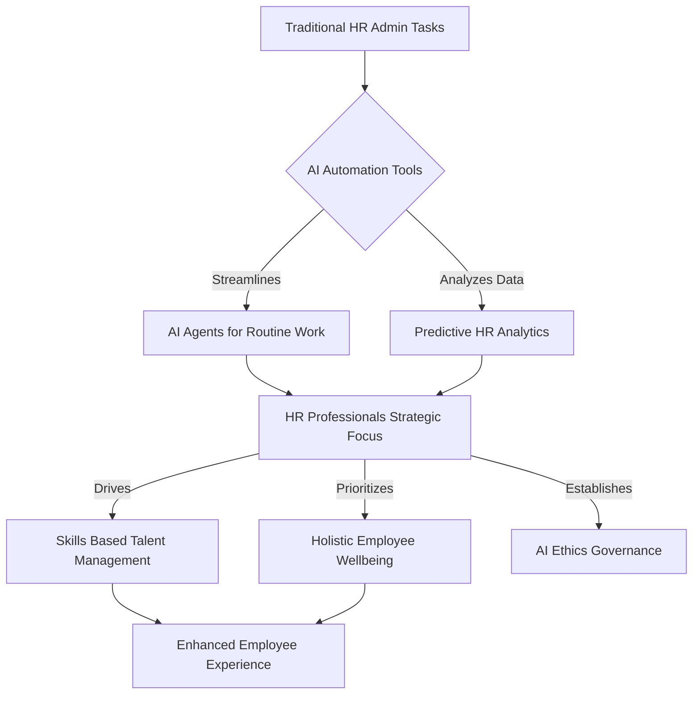

## HR in Motion: Navigating the Human-Machine Era and Holistic Wellbeing in May 2026

As of May 2026, the HR landscape is dynamically reshaping, driven predominantly by the pervasive integration of Artificial Intelligence and an intensified focus on holistic employee wellbeing. HR professionals are no longer just managing people; they are orchestrating a new era of human-machine collaboration and nurturing a workforce that is both resilient and adaptable.

### AI as a Strategic Partner, Not Just a Tool

The most significant shift is AI's evolution from a mere productivity tool to a strategic partner within HR. Organizations are actively deploying AI agents to automate routine administrative tasks, freeing up HR teams to concentrate on high-value, people-centric work. This includes leveraging predictive analytics for stronger retention strategies and personalized onboarding experiences, enabling HR to make data-informed decisions rather than just reacting.

However, this accelerated adoption comes with a critical "HR readiness gap." Many organizations are using AI, but fewer are prepared to use it *well*, emphasizing the need for robust AI governance, ethical frameworks, and significant upskilling initiatives for the HR workforce. The future of HR in 2026 will be defined by leaders who can effectively integrate AI to amplify human potential, rather than simply automate processes.

### Elevating Wellbeing to "Mental Fitness" and Financial Resilience

Beyond technology, employee wellbeing continues its trajectory from a perk to a strategic imperative. The conversation around mental health is notably shifting to "mental fitness," focusing on proactive measures like building resilience and emotional strength *before* burnout or crisis occurs. Employers are responding with mental health coaching, dedicated mental fitness days, and enhanced employee assistance programs.

Financial wellbeing is also taking center stage as economic uncertainties and rising costs impact employees. HR is increasingly offering support to build financial resilience, recognizing the strong link between financial stress and mental health challenges. The trend is towards an inclusive wellbeing ecosystem, moving away from one-size-fits-all programs to personalized support that addresses diverse needs, including women's health and flexible work arrangements.

### Skills-First Approach and the Evolving Workforce

Another critical trend is the acceleration of skills-based hiring and continuous learning. As job descriptions quickly become outdated and AI absorbs portions of entry-level tasks, companies are prioritizing capabilities over traditional degrees to tap into broader talent pools and ensure new hires are genuinely qualified. This necessitates a focus on upskilling and reskilling programs to help employees adapt to technology-driven roles and foster a more fluid workforce ecosystem with clearer pathways for internal mobility.

---

**The Evolving HR Landscape**

