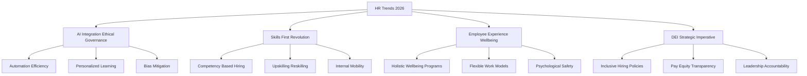

## HR's New Horizon: Decoding the Live Trends of May 2026

As of May 2026, the HR landscape is in a continuous state of dynamic evolution, driven by technological advancements, shifting workforce expectations, and a profound emphasis on human-centric strategies. The administrative function of HR has truly transformed into a strategic powerhouse, directly impacting business resilience and growth.

One of the most significant narratives dominating HR news is the pervasive **integration of Artificial Intelligence (AI)**. AI is no longer a futuristic concept but a tangible tool redefining roles and expectations across the HR spectrum. From automating routine tasks like scheduling and initial candidate screening to powering personalized learning paths and predictive analytics for retention, AI is amplifying HR's capacity for impact. However, this widespread adoption comes with a critical focus on ethical governance and bias mitigation, ensuring AI serves as an augmentation to human judgment, not a replacement. HR leaders are actively working to bridge the "readiness gap" between deploying AI and leveraging it effectively.

Parallel to AI's rise is the **Skills-First Revolution**, fundamentally reshaping how organizations identify, hire, and develop talent. The traditional emphasis on degrees and past job titles is increasingly giving way to a focus on demonstrable skills and competencies. This shift is driven by the rapid evolution of job requirements and talent shortages, allowing companies to tap into wider and more diverse talent pools, foster internal mobility, and improve retention. Continuous upskilling and reskilling programs are now essential tools for both employee growth and organizational agility.

**Employee Experience (EX) and Wellbeing** have solidified their positions as business imperatives, moving beyond "nice-to-haves" to become core components of organizational infrastructure. Holistic wellbeing programs, encompassing mental health support and flexible work models, are critical for preventing burnout and fostering a motivated workforce. Moreover, psychological safety is recognized as the engine behind innovation, encouraging open communication and experimentation. Organizations are prioritizing personalized experiences, recognizing that a positive EX directly correlates with engagement, productivity, and loyalty.

Finally, **Diversity, Equity, and Inclusion (DEI)** has matured into a strategic imperative, with initiatives evolving from performative gestures to embedded, measurable strategies. Companies are focusing on diverse hiring practices, promoting pay equity, and developing mentorship programs for underrepresented groups. Crucially, leadership accountability, often tied to executive compensation, ensures DEI goals are integrated into the core business strategy and reported with transparency.

In essence, HR in May 2026 is defined by a paradox: leveraging cutting-edge technology to cultivate a more deeply human, skilled, and inclusive workplace.

