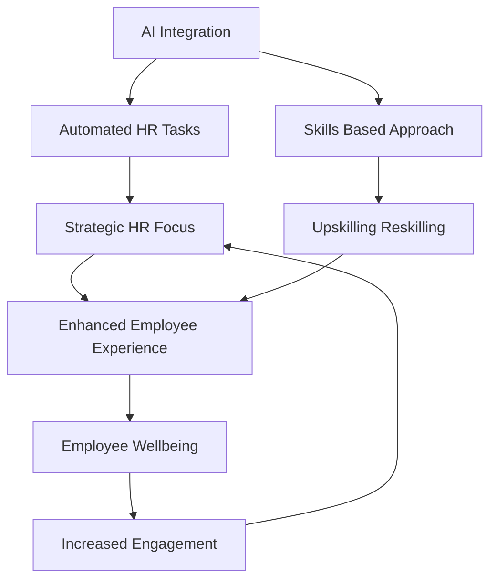

## HR's Pivotal Moment: Navigating AI, Skills, and the Human Element in May 2026

As of May 2026, the HR landscape is undergoing a profound transformation, driven by rapid technological advancements and evolving workforce expectations. HR professionals are no longer just administrators; they are strategic partners navigating complex challenges and opportunities to shape the future of work.

One of the most impactful forces is the pervasive integration of **Artificial Intelligence (AI)** into HR functions. AI is rapidly automating routine and administrative tasks such as CV screening, interview scheduling, and basic candidate screening, freeing HR teams to focus on higher-value activities like culture building, employee experience, and strategic workforce planning. The emergence of "agentic AI"—systems capable of autonomous planning and action—is further accelerating automation within Human Capital Management (HCM). This shift is allowing HR to enhance efficiency and creativity, although concerns about job security and the need for AI literacy among professionals remain.

Hand-in-hand with AI, a **skills-first revolution** is fundamentally reshaping how organizations approach talent. Traditional job titles are giving way to a focus on transferable skills and capabilities as the "operating system of work." This paradigm shift is crucial for addressing widening skills gaps and building an adaptable workforce. Companies are increasingly investing in upskilling and reskilling programs, recognizing that continuous learning is essential for employees to keep pace with technological change and for businesses to remain competitive.

Amidst this technological evolution, the **holistic employee experience and well-being** remain paramount. Organizations are recognizing that employee well-being encompasses more than just physical health, extending to mental and financial health, which directly impact job performance and retention. However, global employee engagement saw a decline in 2025 to its lowest level since 2020, highlighting a critical area for HR focus. Employees expect personalized experiences and support in adapting to change, making strong leadership and effective change management crucial.

In essence, HR's role is becoming more strategic and complex, demanding a blend of emotional intelligence, digital fluency, and strategic thinking. The challenge for HR leaders in 2026 is to thoughtfully integrate technology while prioritizing the human element, ensuring compliance, and fostering a resilient and engaged workforce.

