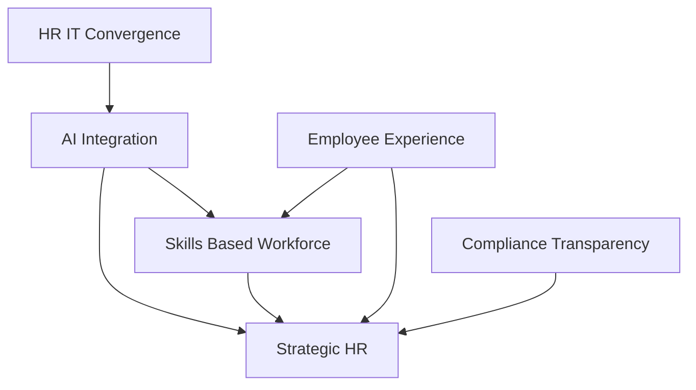

## HR's Dynamic Horizon: Navigating May 2026's Top Trends

As of May 23, 2026, the HR landscape continues its rapid evolution, driven by technological advancements, shifting workforce expectations, and an increasing demand for strategic foresight. HR professionals are no longer just administrators; they are pivotal architects of organizational resilience and growth. Here's a look at the most relevant live HR trends shaping today's workplace.

One of the most significant narratives is the ongoing **integration of Artificial Intelligence (AI)** into HR functions. We're witnessing a notable shift from basic automation to agentic AI, which can autonomously plan and act to achieve multi-step goals. Contrary to earlier fears, AI adoption is increasingly correlating with headcount growth rather than reduction, forcing businesses to rethink talent acquisition, retention, and development. This means HR is becoming more technical, leveraging AI to streamline decisions and reduce administrative burdens, thereby freeing up time for more human-centered, strategic tasks like repairing trust and navigating conflict. The evolving regulatory environment, particularly concerning AI's use in employment decisions, is also a critical focus for HR leaders.

The **shift to a skills-based workforce** continues to gain momentum. Organizations are moving away from traditional job titles to focus on skills as the fundamental building blocks of work, unlocking greater agility and improving internal mobility. This paradigm requires companies to reassess their skills inventories and invest heavily in upskilling and reskilling initiatives to bridge widening talent gaps and future-proof their workforce. Learning Management Systems (LMS) enhanced with AI are becoming crucial for strategically aligning upskilling efforts with business outcomes.

**Employee experience and well-being** remain paramount. Expectations around comprehensive well-being continue to rise, pushing total rewards strategies towards intentional design that is coherent, understandable, and aligned with how people live and work. While employee engagement reached a five-year high in 2025, HR leaders are advised against scaling back efforts, instead focusing on empowering managers to coach and refining benefits based on genuine employee desires to sustain this momentum amidst ongoing economic uncertainty. Dignity-centered separations are also becoming a standard for maintaining trust and culture after difficult exits.

Finally, **HR's strategic role is solidifying**, with an increasing interdependence between HR and IT functions, and many IT leaders predicting a complete merger within five years. Data and tech-driven decision-making are becoming core competencies, transforming HR from a support function into a strategic operator. Recent news also highlights the dynamic nature of compliance, with the Equal Employment Opportunity Commission (EEOC) submitting a proposal on May 14, 2026, to rescind mandatory EEO-1 reporting requirements, although the 2026 filing deadline remains a reality until a final rule is implemented. This demonstrates HR's ongoing need for agility in navigating expanding compliance obligations across jurisdictions.

In this environment, HR leaders who embrace ambiguity, creativity, and complexity, rather than solely relying on predictability, will be best positioned to thrive in 2026 and beyond.

