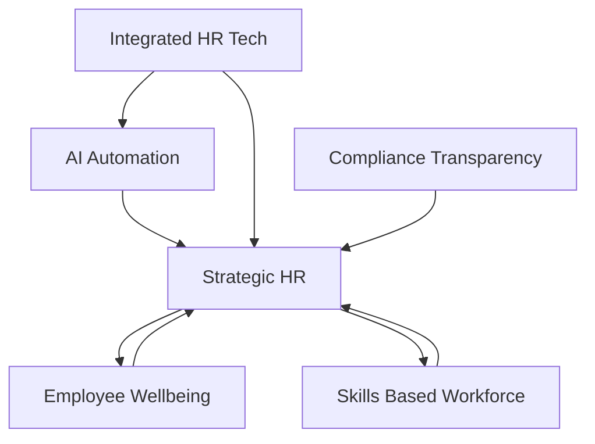

## HR in 2026: Navigating a Human-Machine Era

As of May 2026, Human Resources is undergoing its most significant transformation yet, moving from a supportive role to a strategic powerhouse. The convergence of advanced technology, evolving workforce expectations, and a dynamic regulatory landscape is reshaping how organizations attract, develop, and retain talent.

**Key HR Trends Defining 2026:**

1.  **Agentic AI is the New HR Co-pilot:** AI and automation are no longer futuristic concepts; they are embedded in daily HR operations. We're seeing "agentic AI" systems that can autonomously plan and execute multi-step HR workflows, from candidate screening and onboarding personalization to complex payroll calculations and predictive analytics for workforce trends. This isn't about replacing HR professionals, but enabling them to focus on high-value, strategic initiatives that require empathy, judgment, and human connection. The goal is to leverage AI to surface critical patterns and then drive human-led action.
2.  **The Rise of the Skills-Based Workforce:** The traditional "job title" is giving way to a "skills-based" paradigm. Organizations are increasingly focusing on identifying, mapping, and developing specific capabilities rather than rigid roles. This shift enhances internal mobility, fosters continuous learning, and allows businesses to adapt rapidly to changing market demands. However, it also brings the challenge of "skillfishing," where candidates exaggerate abilities, emphasizing the need for robust verification processes.
3.  **Wellbeing as Core Organizational Infrastructure:** Employee wellbeing has moved beyond a perk to become a fundamental component of organizational design and leadership. Companies are recognizing that burnout and stress are systemic issues, impacting performance, retention, and overall resilience. This means a proactive focus on "mental fitness," financial resilience, inclusive support, and designing work in ways that are sustainable and healthy for employees.
4.  **Integrated HR Technology Ecosystems:** Fragmented HR tech stacks are becoming obsolete. The demand for unified, hyper-automated platforms that seamlessly manage the entire "hire-to-retire" lifecycle is peaking. These integrated systems provide full-funnel visibility, automate workflows, and offer real-time data for smarter, more consistent talent management.
5.  **Compliance and Transparency are Paramount:** The regulatory environment is more complex than ever, particularly concerning AI usage, data protection, and pay transparency. HR leaders are tasked with establishing strong governance frameworks for AI, ensuring ethical deployment, and building trust through clear and consistent compensation practices.

As HR leaders navigate 2026, success hinges on balancing technological innovation with a profoundly human-centric approach, ensuring that new tools amplify our greatest asset: our people.

