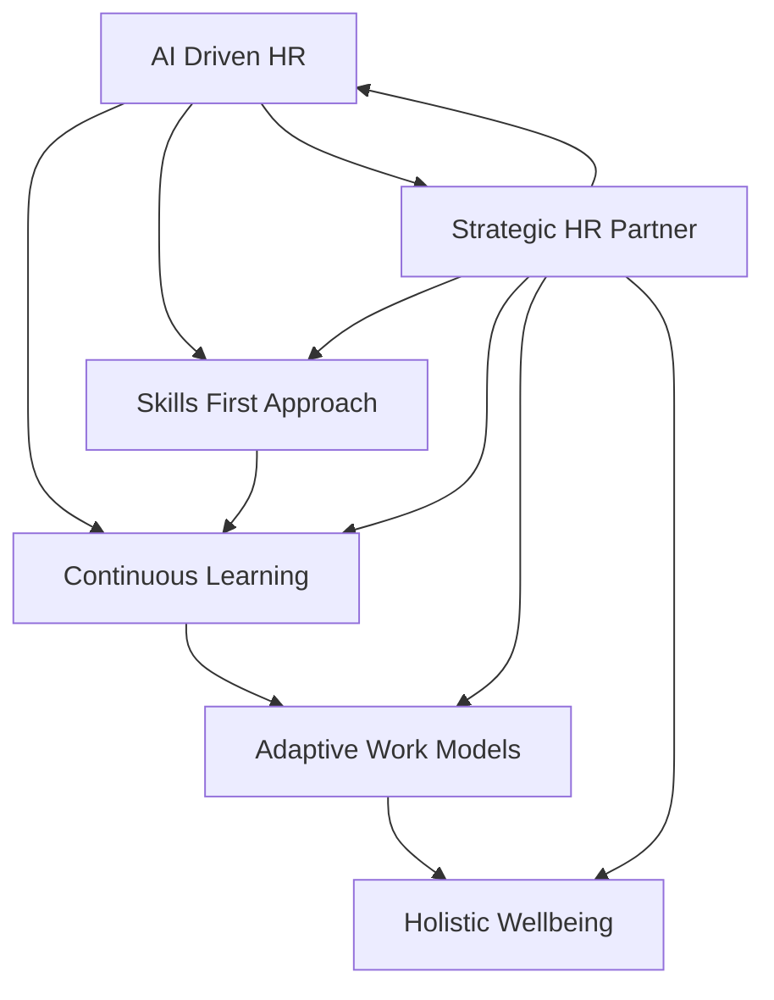

## HR's Evolving Blueprint: Navigating 2026's Live Trends

As of May 28, 2026, the HR landscape is dynamically reshaping, driven by technological acceleration, evolving employee expectations, and the critical need for agile workforces. HR leaders are no longer just administrators; they are strategic architects, balancing human-centric approaches with cutting-edge innovation.

**AI Integration as a Core Competency:** Artificial intelligence continues its rapid integration into HR, moving beyond simple automation to "agentic AI" that can plan and act autonomously to achieve multi-step goals. This shift is revolutionizing HR functions from recruitment and onboarding to performance management and workforce planning. HR's focus is on harnessing AI to enhance human potential, necessitating new strategies for AI governance and accountability within people decisions.

**The Skills-First Revolution and Continuous Learning:** The widening skills gap, fueled by the pace of AI and digital transformation, is a top priority. Organizations are transitioning from traditional job titles to a skills-based approach for hiring, development, and talent mobility. Upskilling and reskilling initiatives are paramount to build a future-ready workforce, making continuous learning a strategic imperative for employee retention and organizational adaptability.

**Holistic Employee Wellbeing Takes Center Stage:** Employee wellbeing has expanded into a comprehensive "whole-person" approach, encompassing mental fitness, financial resilience, and inclusive women's health support. Employers are offering flexible benefits, mental health days, and support for financial stress, recognizing these as critical drivers for engagement, productivity, and reduced turnover.

**Adaptive and Flexible Work Models:** While many companies continue to encourage a return to the office, flexibility remains a highly valued perk, often shifting emphasis from *where* to *when* work is done. Personalized hybrid models, rather than rigid mandates, are gaining traction as organizations seek to balance collaboration needs with employee autonomy and work-life balance.

These trends collectively position HR at the strategic forefront, tasked with guiding organizations through continuous change and fostering cultures where technology amplifies human creativity, empathy, and judgment.

