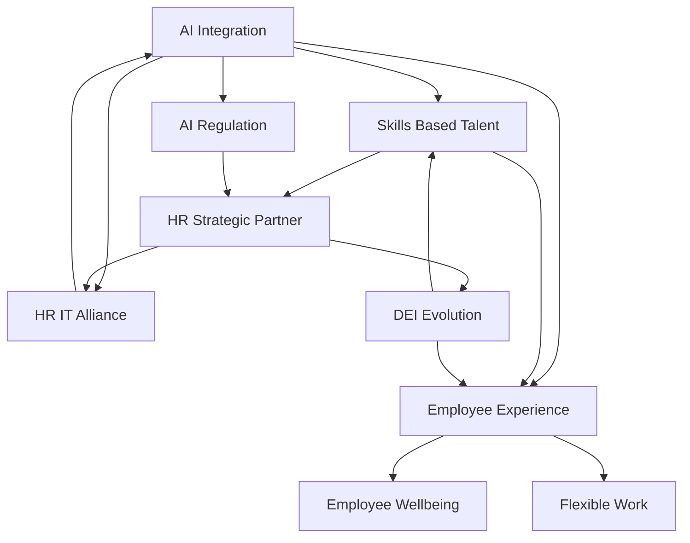

## HR Navigates a New Era: Top Trends Defining June 2026

As of June 1, 2026, the human resources landscape is buzzing with transformative changes, driven by technological leaps, evolving workforce expectations, and dynamic regulatory shifts. HR leaders are no longer just administrators; they are strategic architects crafting the future of work.

One of the most impactful forces is **Artificial Intelligence (AI) Integration**. AI is fundamentally reshaping HR functions, from automating routine tasks like scheduling and data entry to influencing hiring and performance management. This shift necessitates a close **HR-IT Alliance**, with many predicting a complete merger of these functions within five years as HR leaders rely on IT expertise to implement secure and compliant AI systems. The increasing adoption of "agentic AI" also means a focus on AI literacy and augmenting human capabilities rather than outright automation, though some roles may be replaced. Alongside this, **AI Regulation** is rapidly evolving, with new acts emerging, such as Colorado's AI Act taking effect this very month, governing AI in employment decisions.

Another pivotal trend is the widespread adoption of **Skills-Based Talent Strategies**. Organizations are moving away from traditional credentials like degrees and job titles, prioritizing instead a candidate's demonstrated capabilities and competencies. This approach broadens the talent pool, reduces bias, improves retention, and supports internal mobility and continuous learning. It's about what people *can do* rather than just where they've worked.

**Employee Experience and Wellbeing** remain paramount. The focus is on creating personalized and meaningful work environments, addressing burnout, and supporting mental health. This includes offering **Flexible Work** arrangements, with hybrid models becoming standard, and ensuring equitable flexibility across the workforce. Employee engagement, however, saw a dip in 2025, underscoring the need for proactive strategies.

The **DEI Evolution** continues, shifting from isolated initiatives to embedded systemic change and accountability. While still critical for attracting talent and business success, the landscape is navigating new regulations and executive orders, particularly in the U.S., which may restrict certain DEI practices for federal contractors. Pay transparency is also gaining traction, enhancing trust and competitiveness, with directives like the EU Pay Transparency Directive coming into full effect by June 2026.

In this dynamic environment, HR's role is clearly elevated to a **Strategic Partner**, deeply involved in workforce planning, organizational resilience, and leading transformation rather than merely a support function.

Here's a look at how these interconnected trends are shaping HR today:

