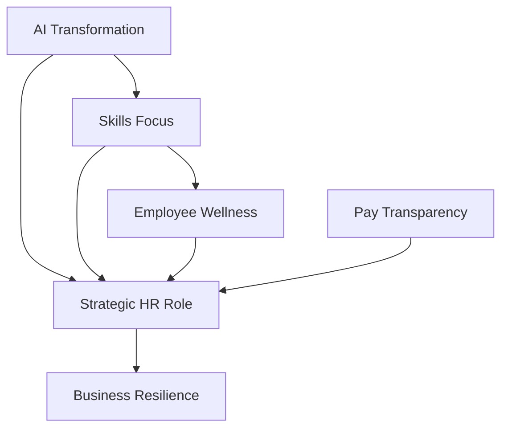

## HR in Motion: Navigating the Core Trends of June 2026

As June 2026 unfolds, the HR landscape is buzzing with dynamic shifts, cementing HR's role as a strategic imperative rather than a mere support function. Today's headlines reveal a confluence of technological advancement, evolving employee expectations, and regulatory changes shaping how organizations attract, retain, and develop talent.

Artificial intelligence (AI) continues its relentless march, transforming HR operations from recruitment to talent development. We're seeing a shift beyond basic automation to "agentic AI" and "superagents" capable of managing entire HR workflows, significantly impacting how work is structured and executed. This evolution frees HR professionals from administrative burdens, allowing them to focus on strategic initiatives like predictive workforce planning and enhancing the employee experience. Consequently, HR leaders are increasingly acting as architects of AI-enabled workplaces, emphasizing ethical AI practices and robust governance to ensure fairness and trust.

Employee well-being has transcended being a mere perk to become a fundamental component of organizational infrastructure. The conversation is shifting from reactive "mental health awareness" to proactive "mental fitness," focusing on building resilience before burnout occurs. Employers are enhancing support for financial wellness, recognizing its link to mental health, and providing more inclusive programs, including specific support for women's health. This holistic approach is crucial for boosting engagement and retention in an increasingly volatile work environment.

Another dominant trend is the rise of a skills-based workforce. Organizations are increasingly prioritizing skills over traditional job titles or academic credentials to foster agility and enhance internal mobility. This paradigm shift necessitates significant investment in reskilling and upskilling programs to prepare employees for emerging roles, often in collaboration with IT departments. Hand-in-hand with this is the expanding mandate for pay transparency, driven by new regulations like the EU Pay Transparency Directive, which comes into full effect this month. This requires employers to disclose salary ranges and report gender pay gaps, making pay equity a critical differentiator for talent and trust.

These interwoven trends underscore HR's elevated position in guiding organizations through continuous change. From leveraging AI responsibly to championing holistic well-being and a skills-first approach, HR leaders are at the forefront of building resilient, adaptable, and human-centered workplaces in 2026 and beyond.

