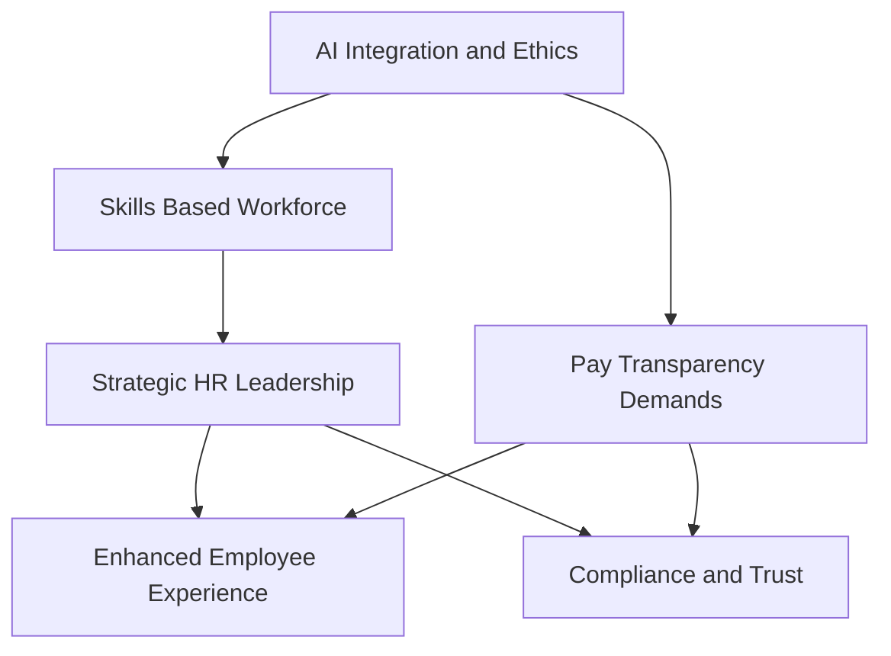

## The Human-Centric Evolution: Navigating HR Trends in Mid-2026

As of June 2026, the landscape of Human Resources is undergoing a profound transformation, driven by rapid technological advancements, evolving employee expectations, and a heightened focus on strategic organizational resilience. HR is no longer a back-office function but a pivotal strategic partner guiding businesses through continuous change.

One of the most impactful forces is **Artificial Intelligence (AI)**, which is redefining roles and expectations across the workforce. AI is moving beyond a mere productivity tool to become a strategic operator, automating tasks, and creating new demands for human skills. However, this integration comes with a critical need for ethical oversight and human-centered decision-making, especially as regulations around AI in employment decisions are taking effect in various regions, including the EU and parts of the US. Interestingly, recent research indicates a growing trust gap, with one in four employees globally trusting AI more than their HR department to assess pay equity.

This shift is accelerating the move towards a **Skills-Based Workforce**. Organizations are increasingly prioritizing capabilities and skills over traditional job titles and educational credentials for hiring, talent development, and internal mobility. This approach allows for greater flexibility and resilience in a fast-changing environment, enabling organizations to adapt quickly and employees to see clearer pathways for growth.

**Employee Wellbeing and Experience** continue to be paramount. Wellbeing is evolving from a collection of programs to becoming foundational organizational infrastructure, directly influencing work design, leadership styles, and team resilience. Empathetic leadership is crucial in this digital era, where human creativity, emotional intelligence, and resilience remain irreplaceable by technology.

Finally, **Pay Transparency** is at the forefront of compliance and trust. The EU Pay Transparency Directive, which came into force in June 2026, mandates employers to provide salary ranges to job applicants and report on gender pay gaps, signaling a global trend towards greater openness. Employees now expect more rigorous pay transparency, and their trust in employers can hinge on how these policies are implemented.

Here's a look at the interconnectedness of these trends:

