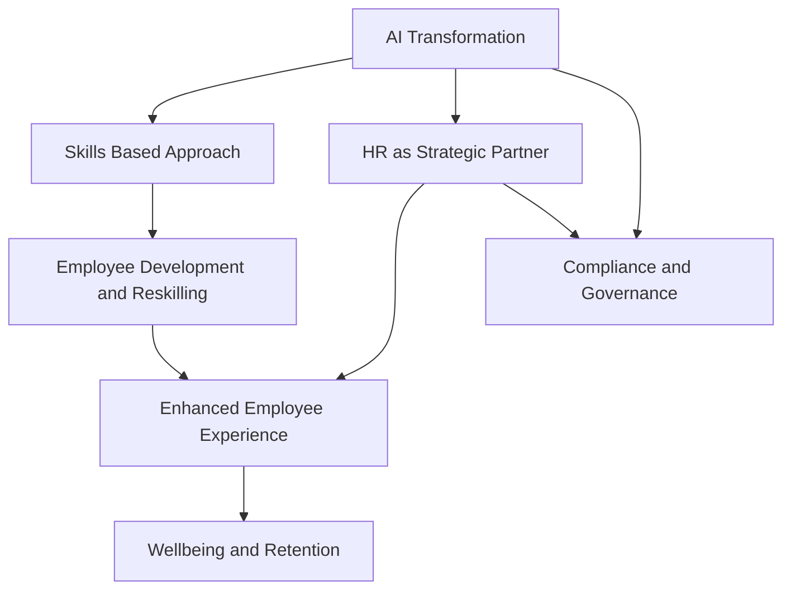

## HR Navigates 2026: AI, Skills, and a Strategic Shift

As of June 2026, the HR landscape is experiencing a profound transformation, moving beyond traditional administrative roles to become a critical strategic driver for organizations. The confluence of technological advancement, evolving workforce expectations, and a dynamic economic climate is redefining HR's priorities and operational models.

At the forefront of these changes is the **pervasive influence of Artificial Intelligence (AI)**. AI is not merely a tool for automation but a fundamental disruptor, reshaping job roles, enhancing HR processes, and demanding new competencies across the workforce. Organizations are grappling with how to effectively integrate AI, manage ethical considerations, and ensure employees are proficient in leveraging AI for productivity. This shift necessitates a strong partnership between HR and IT to co-lead cultural and business change.

Closely linked to AI is the accelerated move towards a **skills-based workforce and hiring approach**. Traditional role-based planning is giving way to a focus on specific skills, connecting talent development with internal mobility and long-term organizational resilience. This enables businesses to adapt more flexibly to change and offers employees clearer pathways for growth. Consequently, **learning and development** are becoming paramount, with a strong emphasis on upskilling and reskilling to address emerging skills gaps, particularly those created by AI.

Employee well-being has solidified its position as a core organizational infrastructure, rather than just a standalone program. Burnout is recognized as a significant board-level risk, pushing HR to design work, support managers, and create sustainable roles that prioritize mental and physical health. This holistic view of well-being directly impacts **employee experience and retention**, which remain top priorities for HR leaders seeking to build engaged and resilient workforces.

Furthermore, **compliance obligations are expanding**, particularly concerning AI oversight, pay transparency, and leave policies, directly influencing trust and culture within organizations. This environment underscores HR's evolution into a **strategic partner**, requiring data-driven decision-making and a focus on measurable business impact to navigate constant change and uncertainty.

The current landscape demands agility, foresight, and strong leadership from HR, as the function pivots from being a support system to a central driver of organizational success and resilience.

