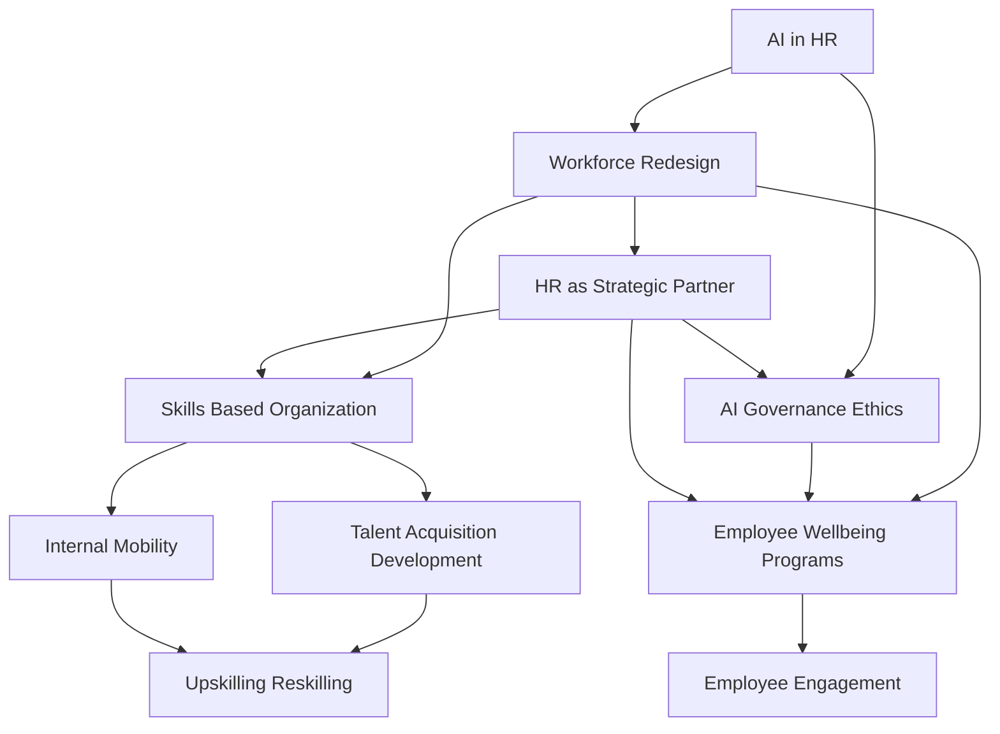

## Mid-2026: Navigating the New HR Landscape – AI, Skills, and Wellbeing at the Forefront

As of June 2026, Human Resources is at a critical juncture, rapidly evolving from a support function to a strategic imperative. Economic pressures, technological advancements, and shifting employee expectations are redefining the very essence of work, demanding agility and foresight from HR leaders. The workplace is increasingly intelligent, interconnected, and human-centric, requiring a delicate balance between innovation and compassion for sustainable growth.

### AI's Pervasive Influence and the Agent Workforce

Artificial intelligence is no longer just a tool; it's a workforce disruptor, redefining roles and creating new opportunities. We're seeing the rise of "agentic AI" where software agents work alongside humans, automating tasks and offering predictive insights for workforce planning, recruitment, and even performance reviews. This rapid adoption necessitates robust AI governance and ethical frameworks to manage permissions, accountability, and data security, with many organizations still in pilot mode but planning broader integration. HR's role is increasingly focused on designing human-machine collaboration and ensuring responsible AI use.

### The Skills Revolution: From Roles to Capabilities

The shift towards a skills-based organization is in full swing. Companies are prioritizing capabilities over traditional job titles and experience, fundamentally impacting hiring, internal mobility, and learning and development strategies. This approach allows for greater workforce agility, reduces redeployment risk, and helps address the widening skills gap accelerated by AI and digital transformation. Continuous upskilling and reskilling are paramount to prepare employees for emerging roles and ensure long-term resilience within dynamic skill frameworks.

### Holistic Wellbeing as Organizational Infrastructure

Employee wellbeing has moved beyond a perk to become a core business strategy and organizational infrastructure. The focus is holistic, encompassing mental fitness (proactive resilience building), financial health, and comprehensive support for diverse needs, including women's reproductive health. Burnout remains a significant challenge, with over half of US workers reportedly "languishing" according to recent studies, highlighting the need for improved work design and supportive team conditions. Organizations are rethinking work design, leadership approaches, and providing personalized, science-backed strategies to support their workforce physically, emotionally, socially, and professionally.

### HR as a Strategic Partner in Workforce Redesign

HR is increasingly viewed as a strategic partner, guiding organizations through significant workforce redesigns. This involves aligning talent strategies with business goals, developing "now-next" approaches to balance immediate performance with long-term objectives, and proactively addressing change fatigue. The interdependence between HR and IT is also growing, becoming critical for implementing complex technologies like agentic AI effectively and ensuring data environments support these initiatives. Compliance obligations, particularly around AI oversight and pay transparency, are also expanding, further cementing HR's strategic role in shaping trust and culture.

The HR landscape in mid-2026 is dynamic and complex. Success hinges on HR leaders' ability to embrace technological innovation, champion skills-based talent strategies, embed comprehensive wellbeing as a core principle, and act as strategic architects of a human-machine workforce. Navigating these interconnected trends with agility and a human-centric approach will be key to organizational resilience and sustainable growth.

