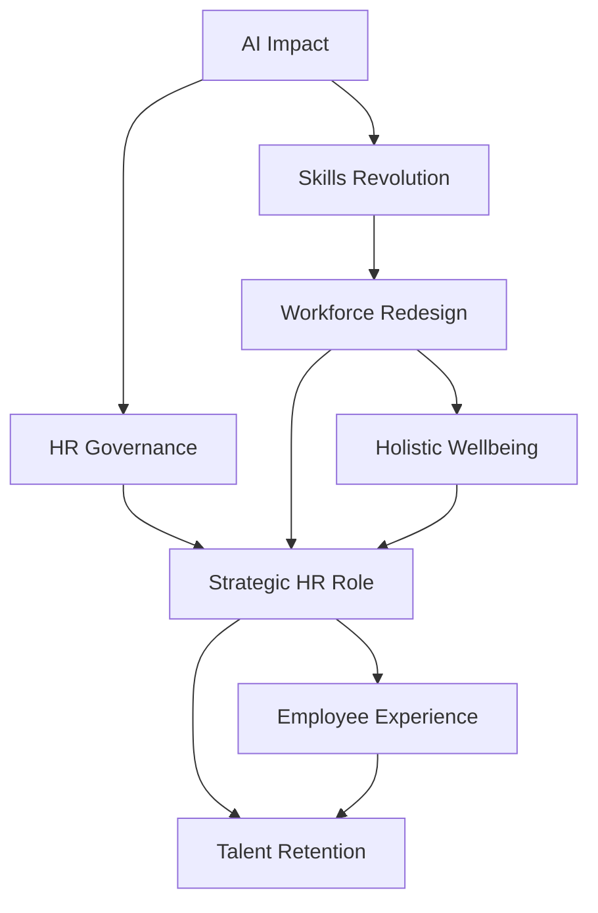

**HR at the Helm: Navigating 2026's Evolving Workforce Landscape**

As we reach mid-2026, the Human Resources landscape is experiencing a dynamic transformation, moving beyond traditional roles to become a central strategic partner in organizational success. The confluence of technological advancement, evolving employee expectations, and a continuous focus on well-being defines this era.

A major headline involves the ongoing integration and governance of Artificial Intelligence. While AI promises significant efficiencies in HR functions like recruiting and workforce planning, its ethical deployment remains a critical concern. For instance, Meta recently scaled back plans to monitor employee activity for AI data collection following internal pushback over privacy concerns. Conversely, Microsoft is actively piloting AI-enabled wearable devices and desktop cubes to interact with autonomous AI agents, pushing the boundaries of human-AI collaboration in the office. These developments underscore HR's crucial role in establishing AI governance frameworks and ensuring ethical use to maintain employee trust and a positive organizational culture.

This AI-driven shift directly accelerates the **Skills Revolution**. The workforce is rapidly transitioning from a role-based to a skills-based paradigm, necessitating continuous upskilling and reskilling initiatives. Organizations are increasingly using AI-powered tools for skills gap analysis to identify disparities between current capabilities and future needs, making data-driven decisions for hiring and development. This proactive approach is vital, as studies indicate that by 2027, many skills needed just two years prior will already be outdated.

Furthermore, **Holistic Employee Well-being** remains a non-negotiable priority, evolving into a more proactive and personalized approach. The conversation has shifted from just "mental health awareness" to "mental fitness," emphasizing resilience building and emotional strength before burnout occurs. Employers are expanding support to include financial well-being, women's health (from fertility to menopause), and inclusive programs that cater to diverse needs. Companies are recognizing that investing in comprehensive well-being directly impacts retention, productivity, and overall workplace culture.

In this environment, HR is firmly establishing itself as a strategic operator. HR leaders are tasked with balancing rapid AI adoption with stringent compliance obligations, including burgeoning AI regulations and expanding pay transparency mandates. The ability to navigate these complexities, foster human-centric cultures, and strategically align talent with business objectives will define organizational resilience and competitiveness in 2026 and beyond.

