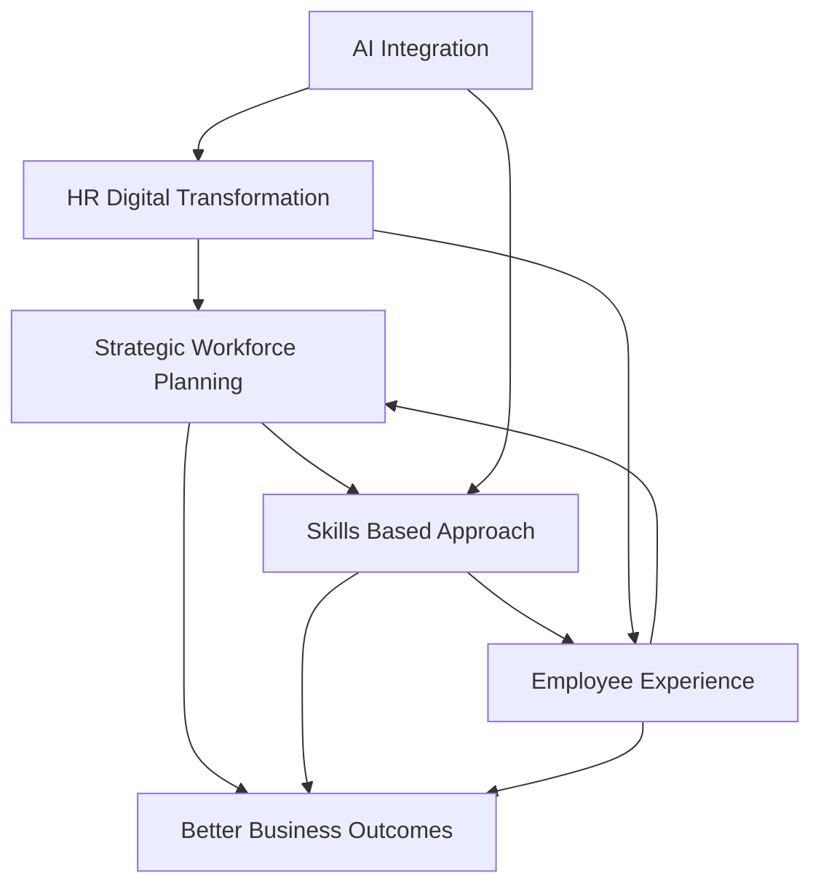

## HR in Mid-2026: Navigating the AI-Driven, Skills-Focused Future

As of June 2026, the Human Resources landscape is experiencing a profound transformation, driven by technological advancements, evolving employee expectations, and the persistent need for organizational agility. HR leaders are no longer just managing people; they are strategically shaping the future of work.

A dominant force continues to be the **AI Transformation in HR**. We're seeing a rapid shift from basic automation to "agentic AI" that understands context and proactively supports strategic decisions across hiring, payroll, and overall employee experience. This necessitates a strong alliance between HR and IT to ensure ethical governance and effective implementation of these advanced tools. Organizations are leveraging AI not just for efficiency, but also to gain deeper insights into their workforce.

Accompanying this technological shift is a major move towards a **Skills-Based Approach** to talent management. The traditional focus on job roles is giving way to identifying, developing, and deploying specific capabilities, reflecting the dynamic nature of work in an AI-driven economy. This impacts recruitment, learning and development, and internal mobility, helping organizations remain agile.

**Employee Experience and Well-being** remain paramount. Holistic well-being — encompassing mental, physical, and financial health — is now seen as organizational infrastructure. There's a heightened focus on personalized employee experiences, addressing manager burnout, and understanding the unique retention challenges of different generations, like Gen Z.

Furthermore, **Strategic Workforce Planning** has become a critical business imperative. HR is moving beyond reactive hiring to proactive, data-driven forecasting of talent needs, aligning workforce strategies with overarching business goals. This includes adapting to hybrid work models and integrating the growing gig economy into comprehensive talent strategies. The evolving role sees **HR as a Strategic Partner**, deeply integrated with business outcomes and leveraging technology to drive organizational resilience and competitiveness.

Here's a look at how these trends interrelate:

