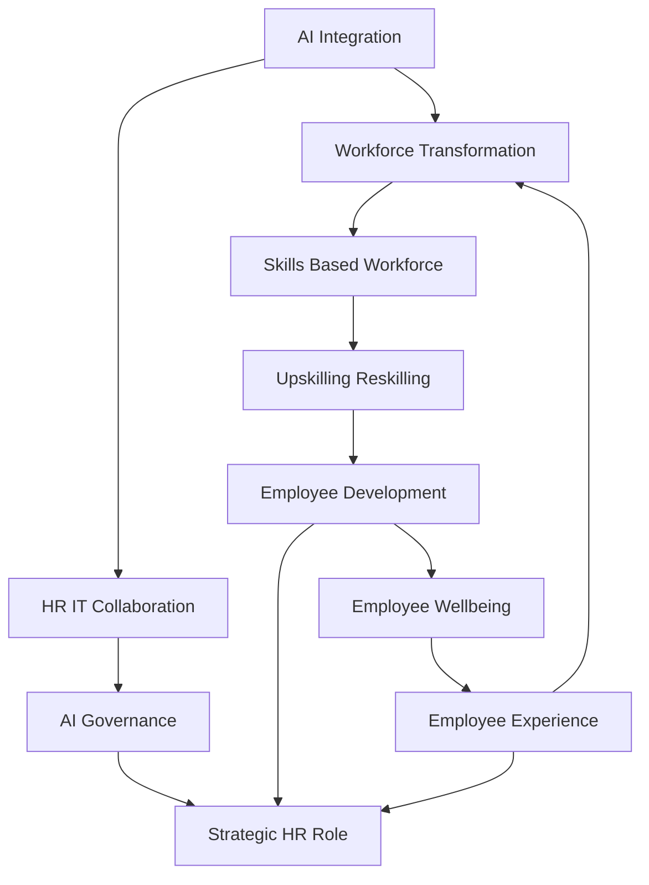

## Navigating 2026: Key HR Trends Defining the Future of Work

As of June 2026, the landscape of Human Resources continues its rapid evolution, moving beyond reactive measures to proactive, strategic imperatives. Organizations are grappling with technological advancements, shifting workforce expectations, and the persistent need for agility. Here are the actual live trends shaping HR today.

**AI's Transformative Role and the Imperative for Governance**
Artificial Intelligence, particularly "agentic AI," is no longer a futuristic concept but a tangible force actively reshaping HR functions. From automating mundane tasks to providing sophisticated talent analytics and supporting strategic decision-making, AI's integration is profound. HR leaders are tasked with not just adopting AI, but also establishing robust governance frameworks to ensure ethical use, data privacy, and fair employment practices. This necessitates closer collaboration between HR and IT to blend technological advancement with human judgment and trust.

**The Ascendance of the Skills-Based Workforce**
The traditional emphasis on job titles and credentials is rapidly giving way to a skills-based approach. Organizations are increasingly focusing on the capabilities and skills individuals possess, rather than just their past roles. This shift is critical for building resilient workforces, enabling internal mobility, and addressing persistent skill gaps driven by accelerating technological change. Upskilling and reskilling initiatives are paramount, not merely as development programs, but as essential tools for retention and strategic growth.

**Prioritizing Holistic Employee Wellbeing and Experience**
Employee wellbeing has matured beyond a collection of discrete programs to become an integral part of organizational infrastructure. It now influences how work is designed, how managers lead, and how sustainable roles feel over time. Similarly, a compelling employee experience is a strategic business imperative, demanding personalized approaches to work arrangements, benefits, and development. Organizations are recognizing that neglecting wellbeing and a positive experience directly impacts performance, retention, and overall leadership effectiveness.

**HR's Evolving Role as a Strategic Business Partner**
In this dynamic environment, HR's role is undeniably shifting from an administrative and support function to a critical strategic partner. HR leaders are now expected to contribute to broader organizational strategy, offering data-backed insights and guiding businesses through continuous change. This involves proactive scenario planning for talent, ensuring compliance considerations converge with culture, and driving organizational transformation with a human-centered approach.

These trends underscore a pivotal moment for HR, where embracing technology, fostering skills, nurturing human potential, and acting as a strategic advisor are key to navigating the complexities of 2026 and beyond.

