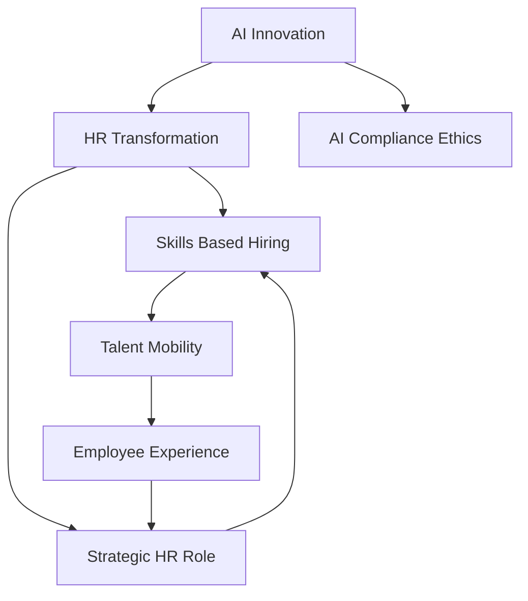

## HR's Evolving Landscape: Key Trends Shaping Mid-2026

As of June 2026, the Human Resources field is experiencing a profound transformation, driven by technological advancements and shifting workforce expectations. The administrative functions of yesterday are rapidly being automated, paving the way for HR to become a truly strategic partner in organizational success.

A paramount trend is the pervasive integration of **Artificial Intelligence (AI)** within HR. Organizations are increasingly adopting "Agentic AI," which can not only generate content but also independently plan and execute multi-step goals. This shift is automating routine tasks like scheduling and initial resume screening, allowing HR professionals to focus on strategic talent leadership, custom employee experiences, and complex decision-making. However, this rapid adoption necessitates a strong focus on **AI compliance and ethical governance**, as regulations governing AI in employment decisions are tightening globally.

Another significant movement is the widespread embrace of a **skills-based approach** to hiring, development, and workforce planning. Nearly 70% of employers are now prioritizing skills over traditional degrees and job titles, recognizing that demonstrated competencies are better indicators of job readiness and performance. This methodology significantly expands talent pools and has been shown to lead to higher retention rates for top performers. Consequently, **talent mobility** — the ability to seamlessly move employees between roles, departments, and even locations based on skills and aspirations — is becoming a strategic imperative for retention and organizational agility.

The cumulative effect of these trends is a redefinition of the **employee experience**. Wellbeing is now seen as organizational infrastructure, influencing how work is designed and managed, moving beyond standalone programs. Personalized workplaces and intentional total rewards design are crucial for fostering engagement, especially as global employee engagement has seen a decline. HR's role is thus evolving from a support function to a **strategic operator**, guiding organizations through continuous change, balancing human needs with business resilience, and integrating compliance into the very fabric of company culture.

