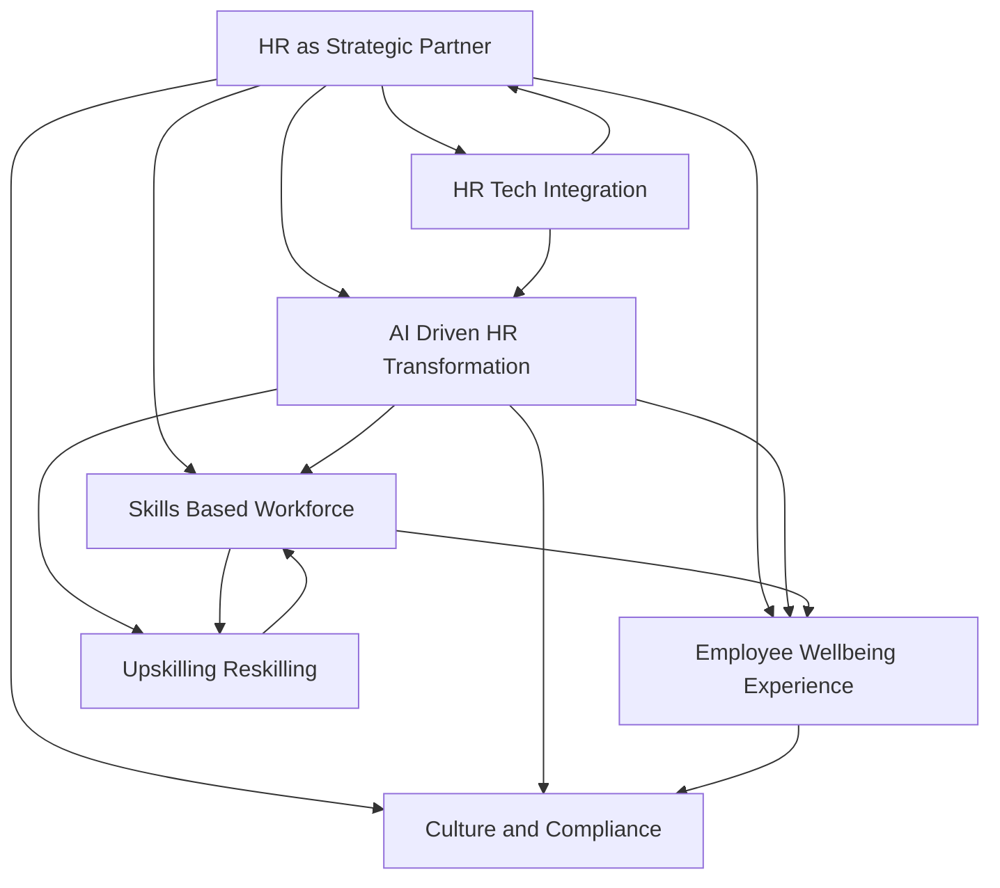

## HR Navigates 2026: AI, Skills, and a Human-Centric Future

As of July 5, 2026, the HR landscape is dynamically reshaping, driven by technological advancements, evolving workforce expectations, and a deepening recognition of HR's strategic importance. No longer merely a support function, HR is now a central driver of organizational resilience and growth, balancing innovation with a critical focus on the human element.

A dominant force in 2026 is the pervasive integration of **Artificial Intelligence (AI)** across HR functions. CHROs are tasked with crafting clear, HR-focused AI strategies, leveraging AI to revolutionize operating models and streamline processes. However, this adoption comes with responsibilities, requiring robust AI governance to address ethical concerns, data privacy, and potential skill erosion. There's a growing emphasis on "agentic AI" which can plan and adapt independently, further expanding automation but also necessitating human oversight and empathetic leadership. Workers themselves anticipate a less human workplace due to AI, highlighting the need for HR to communicate the value of human intelligence alongside AI initiatives.

Complementing the AI revolution is the accelerated shift towards a **skills-based workforce**. Organizations are increasingly moving away from traditional role-based hiring and development, instead focusing on individual capabilities and skills as the building blocks of work. This paradigm allows for greater agility and internal mobility, making **upskilling and reskilling** essential retention tools and critical for preparing employees for emerging roles in an AI-driven world. Central to this evolution is the prioritization of **employee well-being and experience**, which has transitioned from a collection of programs to foundational organizational infrastructure. Addressing burnout, which is now a board-level risk, and ensuring psychological health directly impact productivity and performance.

Furthermore, HR's role has firmly solidified as a **strategic business partner**. HR leaders are now expected to contribute significantly to broader organizational strategy, digital adoption, and talent development, leveraging data-driven insights to inform decisions. This strategic shift mandates enhanced **HR technology upgrades** and a tighter alliance between HR and IT functions, ensuring scalable and integrated systems. The landscape is also marked by a convergence of **culture and compliance**, where decisions around pay transparency and AI oversight are highly visible and directly shape employee trust and organizational culture amidst increasingly complex regulatory environments.

The future of work in 2026 hinges on how deliberately and human-first organizations respond to these interconnected trends. Success will be defined by agile HR strategies that embrace technological advancement while safeguarding trust, fostering development, and prioritizing the well-being of the human workforce.

