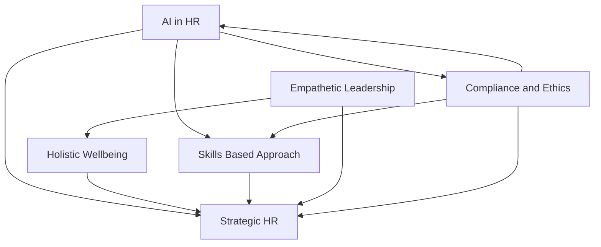

## HR Navigates a Dynamic 2026: AI, Wellbeing, and Skills Take Center Stage

As of July 2026, the human resources landscape continues its rapid evolution, shaped by technological advancements, shifting employee expectations, and a persistent focus on resilience. HR leaders are firmly positioned as strategic architects, balancing innovation with empathy to foster productive and human-centric workplaces.

A dominant force in this transformation is the pervasive integration of **Artificial Intelligence (AI)** across HR functions. AI is no longer just a futuristic concept; it's a present-day partner in HR, redefining roles, streamlining workflows, and aiding in strategic decision-making. From drafting job descriptions to analyzing talent data, AI's practical applications are expanding, making "AI literacy" a baseline skill for HR professionals. However, this surge comes with crucial considerations around ethical use, data privacy, and preventing a "loss of humanity" in the workplace, emphasizing the need for robust AI governance and human oversight.

**Holistic Employee Wellbeing** has solidified its place as a core organizational imperative, moving beyond isolated programs to become integral to business infrastructure. The focus is shifting from reactive mental health awareness to proactive "mental fitness," aiming to build resilience before burnout occurs. Financial wellbeing is also a critical component, with employers increasingly recognizing the link between economic stress and employee performance. Organizations are prioritizing inclusive wellbeing initiatives that cater to diverse employee needs, from women's health support to varied learning preferences.

The talent market is increasingly adopting a **Skills-Based Approach**, signaling a departure from traditional reliance on job titles and academic degrees. Companies are prioritizing demonstrated capabilities for hiring, internal mobility, and talent development, allowing for greater flexibility and responsiveness to evolving business needs. This shift necessitates continuous learning models to help employees acquire and hone essential skills, moving beyond annual training to personalized, ongoing development pathways.

These trends underscore the elevation of **HR as a Strategic Partner**. HR is no longer a back-office support function but a critical driver of business strategy, organizational transformation, and digital adoption. This requires HR leaders to cultivate **Empathetic Leadership**, prioritizing emotional intelligence, adaptability, and clear communication to guide teams through constant change and foster a sense of trust and psychological safety.

Furthermore, **Compliance and Ethics** remain paramount, growing in complexity as new regulations emerge around AI usage, data privacy, and global labor laws. HR's role in navigating these legal frameworks while fostering a culture of trust is more critical than ever.

As employers plan to hire in the second half of 2026, many still face challenges in finding qualified candidates, even as nearly 70% of employees report no salary increase in the last six months, highlighting a perception gap in pay transparency. This dynamic environment demands agile and foresightful HR leadership to balance performance with purpose and build truly resilient, future-ready workplaces.

