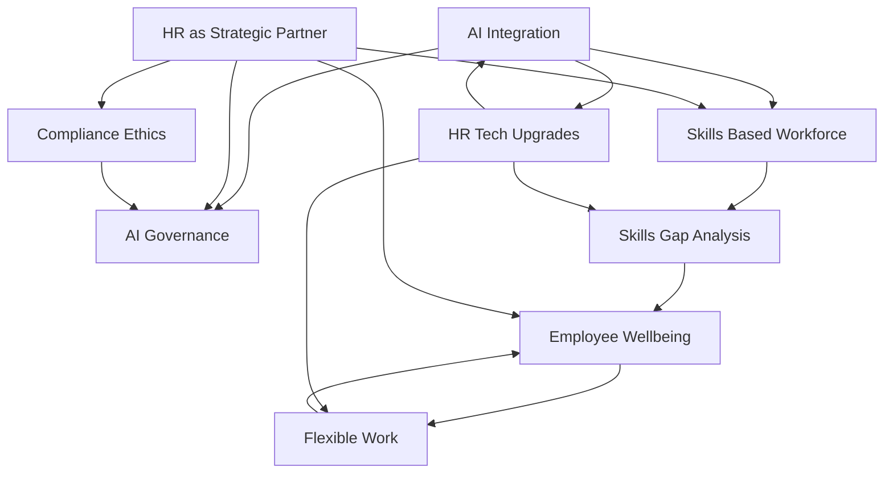

## The Pulse of People: Navigating HR Trends in Mid-2026

As of July 2026, the HR landscape is dynamically evolving, pushing people leaders into increasingly strategic roles. From artificial intelligence to holistic employee well-being, several key trends are redefining how organizations attract, retain, and develop talent.

**AI at the Core, with a Human Hand**
Artificial Intelligence is no longer just an emerging concept; it's rapidly integrating into core HR operations, from recruitment and talent acquisition to compliance and workflow automation. Agentic AI, capable of understanding context and executing tasks, is becoming central to Human Capital Management (HCM) systems. However, this widespread adoption brings a critical need for robust AI governance, ethical frameworks, and transparency to ensure fair and unbiased outcomes. HR professionals are now tasked with co-creating AI governance and training employees to collaborate confidently with AI, acknowledging concerns about a "loss of humanity" in the workplace.

**Skills-First Approach and Bridging the Gap**
The focus is definitively shifting from traditional job titles and degrees to a skills-based workforce paradigm. Organizations are increasingly prioritizing identifying and closing skills gaps through strategic upskilling and reskilling initiatives. This proactive approach is essential as rapid technological advancements and AI reshape job roles at an unprecedented pace. The challenge of "skillfishing"—candidates exaggerating capabilities—means verification is becoming a crucial step in hiring.

**Holistic Employee Wellbeing as Organizational Infrastructure**
Employee well-being has transitioned from a mere perk to an integral part of organizational infrastructure. In 2026, the emphasis is on preventative care, mental fitness, and a holistic approach that addresses physical, mental, and financial health. Gen Z and Millennials, now the majority of the workforce, are driving demands for personalized, data-backed well-being solutions that support long-term health and resilience. Burnout remains a significant concern, making proactive prevention a core business priority.

**Flexible Work: The Enduring Standard**
Despite some calls for a full return to office, flexible and hybrid work models remain firmly established as the new normal. Employees continue to prioritize autonomy over *how*, *when*, and *where* they work. Successful organizations are designing flexibility based on trust rather than control, understanding that it's a key differentiator for attracting and retaining top talent. HR leaders are refining talent strategies to emphasize choice and employee experience in a distributed world, while also navigating evolving compliance for remote and hybrid arrangements.

**Strategic HR and Evolving Compliance**
HR's role has fundamentally transformed, moving from a support function to a strategic operator at the heart of business resilience. HR leaders are guiding organizations through continuous change, balancing people's needs with business objectives. Alongside this, compliance continues to converge with culture, with increased visibility and scrutiny around pay transparency, leave policies, and accommodations. Current news in July 2026 highlights ongoing minimum wage increases, expanded family leave acts, and even novel challenges like religious exemptions for AI use, underscoring HR's critical role in navigating a complex regulatory landscape.

The confluence of these trends positions HR at a pivotal intersection of technology, people, and strategy, making its role more critical than ever in shaping the future of work.

