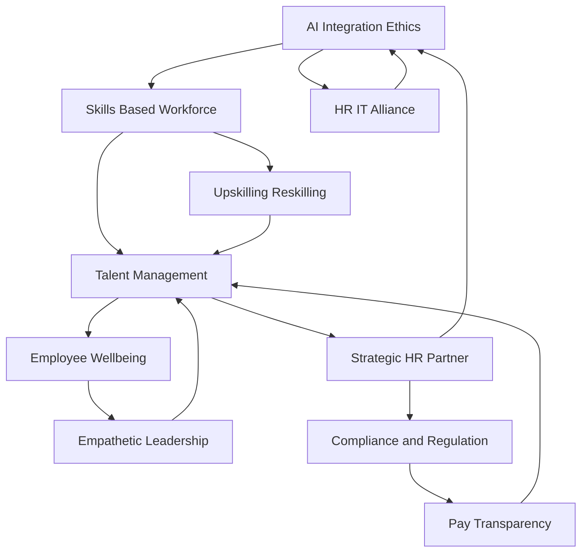

## HR's Evolving Landscape: Live Trends Shaping July 2026

As of July 2026, the Human Resources landscape is experiencing a transformative period, driven by technological advancements, evolving workforce expectations, and a renewed focus on human-centric strategies. HR is no longer merely a support function; it's a strategic imperative, actively shaping organizational resilience and competitiveness.

**AI Integration and Ethical Imperatives**
Artificial intelligence continues to be the most significant disruptor and enabler. HR leaders are balancing the rapid adoption of AI, including sophisticated "agentic AI," with the critical need for trust, compliance, and human-centered decision-making. While AI redefines roles and optimizes tasks, concerns around worker safety and well-being, as highlighted by a recent proposal rejected by Walmart shareholders, underscore the ethical challenges. Moreover, a survey reveals that nearly 9 in 10 HR leaders regret AI-driven layoffs, pointing to the importance of a comprehensive skills inventory before restructuring. The alliance between HR and IT is crucial for navigating these complexities and ensuring responsible AI deployment.

**The Skills Revolution and Workforce Mobility**
The shift from job titles to skills as the fundamental building blocks of work is accelerating. Organizations are heavily investing in upskilling and reskilling programs to address widening skills gaps and prepare employees for emerging roles, such as prompt engineering and algorithmic auditing. This skills-based approach is vital for internal mobility and long-term organizational resilience. Concurrently, employee retention is a growing challenge, with recent reports indicating increased workforce mobility driven by compensation frustrations and optimism about new opportunities.

**Elevating Employee Wellbeing and Empathetic Leadership**
Employee wellbeing is transitioning from a standalone benefit to a foundational organizational infrastructure. Burnout is now recognized as a board-level risk, necessitating systemic shifts in how work is designed and managed. Empathetic leadership, emotional intelligence, and adaptability are becoming more critical than ever, especially as AI takes on routine tasks, making human connection paramount in a digital era.

**Compliance Convergence and Strategic HR**
Regulatory changes, particularly concerning AI in employment decisions and increased demands for pay transparency, are shaping trust and culture in real-time. HR professionals are expected to be experts in employment law, navigating a complex web of local, national, and international regulations. This demand for agility, foresight, and collaboration solidifies HR's role as a strategic partner, driving business impact and growth.

Here's a visual representation of these interconnected trends:

