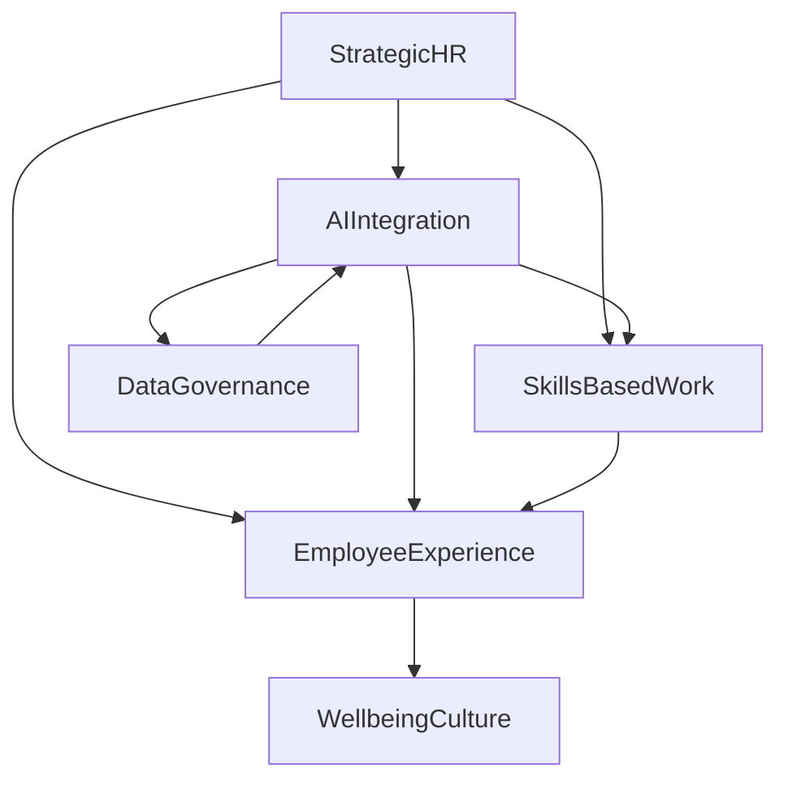

Here's a concise blog post on the latest HR trends, including a Mermaid diagram:

## HR in 2026: Navigating the AI-Driven, Skill-Centric Workforce

As of July 2026, the human resources landscape is dynamically reshaping, driven by rapid technological advancements and evolving employee expectations. HR is firmly positioned as a strategic partner, orchestrating talent, technology, and culture to foster resilient and competitive organizations.

A dominant force continues to be the profound integration of **Artificial Intelligence (AI)** across all HR functions. From "agentic AI" centralizing human capital management (HCM) systems to AI-powered tools revolutionizing recruiting, performance management, and personalized employee support, AI is no longer futuristic but foundational. However, this rapid adoption necessitates robust data environments and stringent governance to ensure ethical use, compliance, and trust.

Alongside AI, the shift towards a **skills-based approach** is gaining significant momentum. Organizations are increasingly moving beyond traditional job titles, focusing instead on identifying, developing, and deploying specific skills as the building blocks of work. This paradigm enables more agile workforce planning, targeted development, and helps align individual capabilities with strategic business goals.

The **employee experience** remains a critical priority, now more integrated with technology and a strong emphasis on holistic **wellbeing**. Companies are leveraging AI to create personalized employee journeys, from onboarding to career development, aiming to energize staff and combat burnout. Supporting mental health, offering flexible work options, and prioritizing time as a valuable currency are key components of fostering a thriving work culture in 2026.

The combined impact of these trends underscores HR's pivotal role in designing workplaces where innovation and humanity flourish together, balancing technological advancement with fairness, trust, and empathetic leadership.

