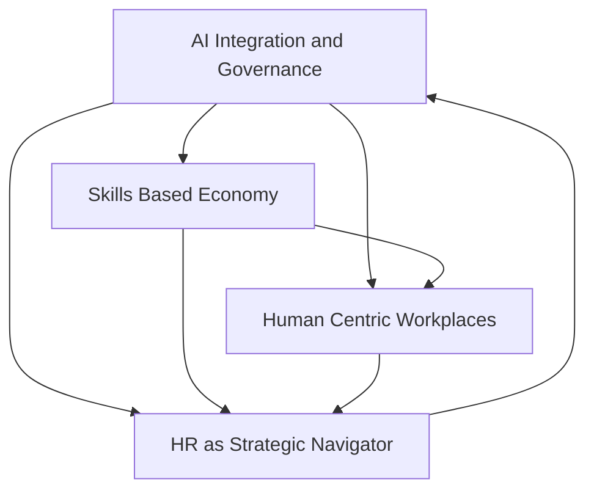

## Navigating Tomorrow: Top HR Trends for July 2026

As of July 2026, the HR landscape is dynamically reshaping, moving from a traditional administrative function to a pivotal strategic driver of organizational success. The ongoing evolution is characterized by rapid technological advancements, a renewed focus on human capital, and an imperative for adaptability. Here are the leading trends defining "actual live news" in HR today.

**AI Integration and Ethical Governance:** Artificial intelligence continues its profound impact on HR, extending beyond automation to "agentic AI" that actively informs and executes HR strategies. From optimizing recruitment and performance management to personalizing the employee experience, AI is redefining operational efficiencies. However, this rapid adoption necessitates a strong emphasis on ethical AI governance, addressing concerns like potential biases, data protection, and maintaining a "human touch" in an increasingly automated world. HR leaders are balancing innovation with trust and compliance, especially concerning AI in employment decisions.

**The Ascendance of the Skills-Based Economy:** The traditional reliance on job titles and degrees is giving way to a focus on skills as the fundamental building blocks of work. Organizations are actively assessing their internal skills inventories and prioritizing skills-based hiring, upskilling, and reskilling initiatives to address evolving talent gaps. This shift allows for greater workforce flexibility and agility, ensuring employees possess the competencies needed for future roles and emerging challenges.

**Human-Centric Workplaces and Wellbeing:** Employee experience and wellbeing are now core business imperatives, not just HR initiatives. Burnout is recognized as a board-level risk, leading organizations to prioritize psychological health and proactive prevention strategies. Empathetic leadership is on the rise, seen as crucial for navigating the digital era and fostering trust and purpose-driven work environments. The emphasis is on building workplaces where employees can genuinely thrive.

**HR as a Strategic Navigator:** HR's role has irrevocably shifted from a support function to a strategic partner, guiding organizations through continuous change and contributing directly to business resilience and competitiveness. Modern HR teams are becoming "pathfinders," adept at ambiguity and complexity, and are increasingly forming critical alliances with IT to leverage technology effectively. This elevated position requires HR professionals to adopt a data-backed approach and contribute to broader organizational strategy.

The current landscape demands that HR leaders drive innovation while maintaining a deep commitment to human values, fostering agility, and ensuring compliance in an interconnected world.

