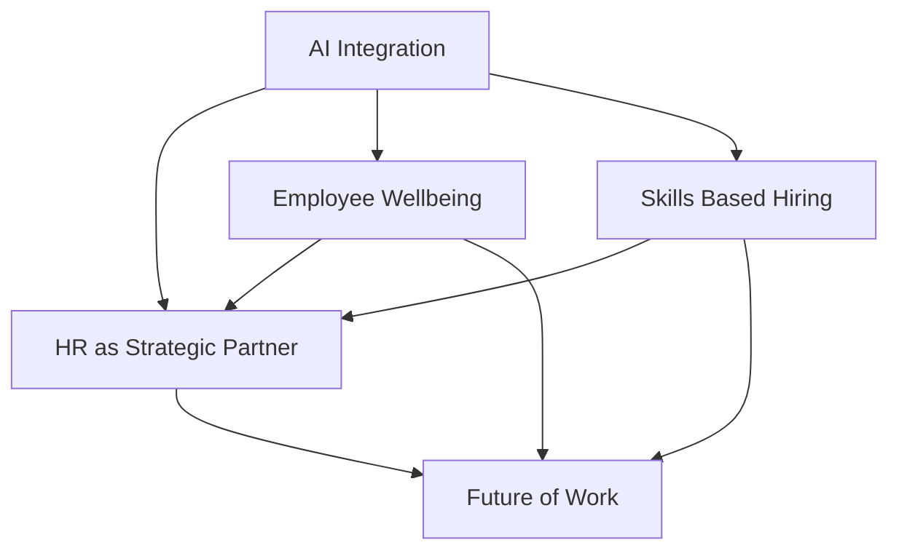

**HR Trends Mid-2026: Navigating a Dynamic Landscape**

As of July 25, 2026, the Human Resources landscape continues its rapid evolution, shaped by technological advancements, shifting workforce expectations, and a strategic recalibration of HR's role. While real-time breaking news is ever-unfolding, several enduring and emerging trends are defining actual HR practices today.

**1. The Rise of Agentic AI in HR**
Artificial Intelligence is no longer a futuristic concept; it's a foundational element transforming HR. Beyond basic automation, agentic AI, which can independently plan, act, and adapt, is becoming a core human capital management (HCM) capability. This advanced AI is impacting everything from payroll anomaly detection and efficient hiring processes to enhancing onboarding and data-driven insights. HR leaders are focusing on blending AI with human judgment to ensure ethical implementation and address potential AI-driven workforce anxiety. AI is seen as a viable alternative to human talent, prompting critical questions about the future of HR.

**2. Holistic Employee Wellbeing as Organizational Infrastructure**
Employee wellbeing has transitioned from a series of standalone programs to becoming an embedded organizational infrastructure. The focus is on mental fitness and burnout prevention, recognizing that stress and burnout are often signals of systemic strain rather than individual failures. Economic volatility, technological acceleration, and intensifying work demands contribute to increased mental health impacts, making comprehensive wellbeing strategies critical for sustained performance. Financial wellbeing is also gaining traction as a strategic infrastructure element.

**3. The Ascendancy of Skills-Based Hiring and Development**
A significant shift is underway, with employers increasingly prioritizing practical skills, competencies, and real-world experience over traditional degree requirements. This "skills over titles" approach is expanding talent pools and addressing labor shortages, with nearly 70% of employers now utilizing skills-based hiring practices for entry-level roles. Continuous upskilling and personalized learning paths are crucial for employees to adapt to new tools and technologies, fostering retention through growth.

**4. HR as a Strategic Business Operator**
HR's role is evolving from a support function to a strategic operator, guiding organizations through continuous change and disruption. This demands a new mindset from HR leaders, who must be energized by ambiguity, creativity, and complexity. A strong partnership between HR and IT is becoming critical for navigating technological advancements and ensuring compliance.

**5. Compliance and the Evolving Regulatory Landscape**
Increased regulatory changes, particularly concerning AI in employment decisions, are becoming the new normal. HR teams are focused on aligning people strategy, compliance readiness, and technology evolution to navigate these evolving legal frameworks.

Here's a visual representation of these interconnected trends:

