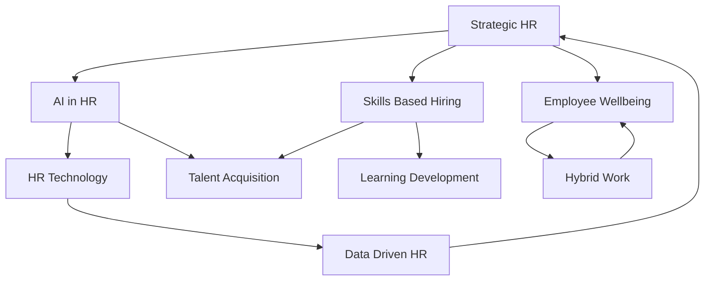

## Navigating Tomorrow: Live HR Trends Defining Mid-2026

The HR landscape in mid-2026 is a vibrant fusion of technological advancement and profound human-centric shifts. As organizations worldwide adapt to an ever-evolving workforce, three core themes are dominating the strategic agendas of HR leaders: the pervasive integration of AI, a renewed focus on holistic employee well-being, and the critical pivot to skills-based talent strategies.

### The AI Revolution: Smarter HR Operations

Artificial intelligence, particularly agentic AI, is no longer a futuristic concept but a central component of Human Capital Management (HCM) systems. This technology is rapidly automating processes like onboarding and payroll, and proactively generating actionable insights from HR data. This deep integration of AI aims to unlock new levels of automation, coordinate multi-step tasks, and adapt to real-world variability in the workplace. However, this rapid adoption also brings forth concerns about a "less human" workplace, necessitating careful governance and ethical frameworks to mitigate risks like bias and ensure human oversight.

### Prioritizing People: Holistic Wellbeing and Flexible Work

Employee well-being has cemented its status as a core business requirement. In 2026, comprehensive well-being programs are vital for retention and performance, addressing not just physical health but also mental health support, preventive care, financial wellness, and opportunities for movement and fitness. This holistic approach is driven by the understanding that a supported workforce leads to higher productivity, lower burnout, and stronger engagement. Crucially, flexible work structures, with hybrid models emerging as the dominant operating model, remain foundational in supporting employee well-being and preventing chronic stress.

### Skills Over Degrees: The New Talent Blueprint

The traditional emphasis on academic degrees is steadily yielding to a skills-first approach in hiring and talent development. Organizations are increasingly evaluating candidates based on practical skills, competencies, and demonstrated real-world experience. This shift is a direct response to persistent labor shortages and the rapid pace at which technology reshapes job requirements. By removing unnecessary degree barriers, employers can tap into a broader talent pool, embracing expertise gained through diverse avenues like certifications, apprenticeships, and on-the-job experience. For employees, continuous upskilling and reskilling are essential to navigate this evolving landscape and maintain career resilience.

As HR continues its evolution from administrative function to strategic partner, staying abreast of these dynamic trends is paramount for fostering engaged workforces and building resilient organizations.

