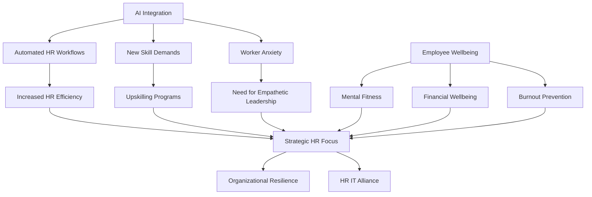

## HR Navigates AI's Rise and Holistic Wellbeing in Mid-2026

As of July 28, 2026, the human resources landscape is dynamically shaped by two dominant forces: the accelerating integration of Artificial Intelligence and a profound shift towards holistic employee wellbeing. HR leaders are currently pivoting from administrative tasks to becoming strategic navigators of these complex changes.

AI is no longer just a futuristic concept; it's a practical force in today's HR functions. Organizations are rapidly adopting AI to enhance recruitment, automate workflows, and optimize employee experiences. The move towards "Agentic AI" is particularly noteworthy, where systems don't merely chat but actively execute HR workflows, significantly boosting efficiency in areas like benefits administration and routine inquiries. However, this rapid integration brings challenges, with a significant percentage of workers anticipating a "loss of humanity" in the workplace, alongside concerns about skill erosion and job displacement. This underscores the critical need for empathetic leadership and a strong HR-IT alliance to ensure AI implementations are human-centered and ethically sound. ADP, for instance, recently announced an HR/IT management integration to streamline processes like onboarding and offboarding by connecting HR and IT systems.

Simultaneously, employee wellbeing has evolved far beyond a mere perk to become a core organizational infrastructure. The focus has broadened from reactive mental health awareness to proactive "mental fitness," emphasizing resilience and emotional strength. Burnout prevention is now a board-level risk, leading companies to invest in workload design, "right-to-disconnect" norms, and recovery time. Financial wellbeing is also a critical pillar, as employees increasingly link financial stress with mental health challenges. This comprehensive approach to wellbeing, often supported by AI and digital tools, aims for personalized and inclusive support, recognizing diverse needs across the workforce.

The intersection of these trends means HR is operating as a strategic partner, guiding organizations through continuous change, balancing technological advancement with human needs, and focusing on skills-based development to prepare the workforce for an AI-augmented future.

