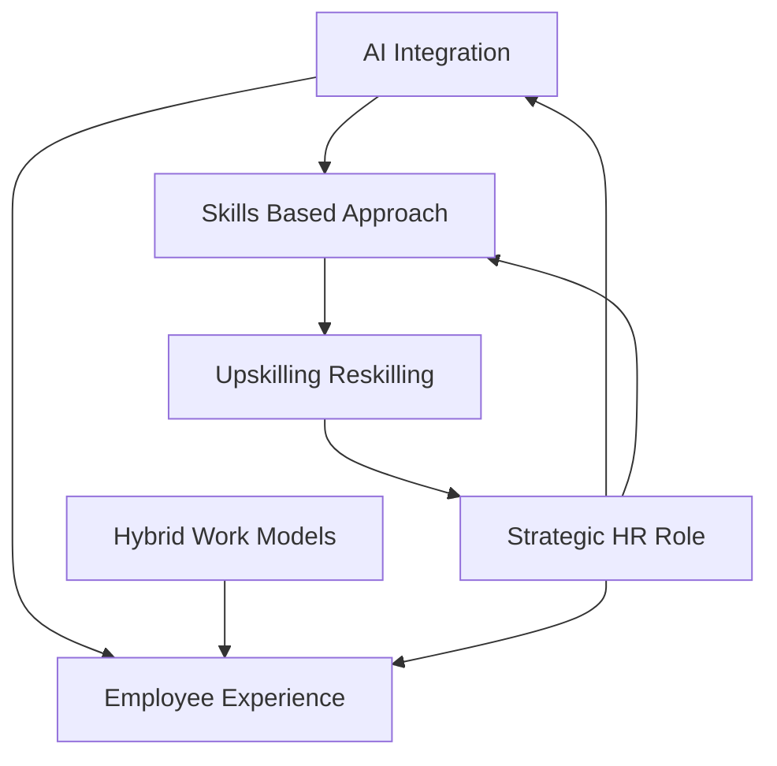

## HR in the Midst of 2026: Navigating a Human-AI Frontier

As of August 2, 2026, the Human Resources landscape is experiencing a profound transformation, driven by technological leaps, evolving employee expectations, and a renewed focus on strategic workforce development. HR professionals are no longer just administrators; they are pivotal strategists guiding organizations through an era of unprecedented change.

**The AI Revolution in Full Swing**
Artificial Intelligence, particularly "agentic AI" that can independently plan and execute multi-step goals, is no longer a futuristic concept but a central component of Human Capital Management (HCM) systems. Organizations are increasingly using AI for everything from streamlining recruitment and automating routine tasks to personalizing employee experiences and enhancing decision-making. This pervasive integration necessitates robust AI governance and a strong alignment between HR and IT departments to ensure ethical deployment and data security. The challenge now is making AI tools actionable and building trust in AI across HR functions.

**Skills Over Roles: A New Talent Paradigm**
The rapid evolution of technology, especially AI, is fundamentally reshaping job roles and the skills required for success. We are witnessing a definitive shift towards skills-based hiring and strategic workforce planning. Companies are prioritizing candidates' practical capabilities over traditional qualifications, with a significant emphasis on upskilling and reskilling the existing workforce to meet new demands, particularly in AI literacy. HR's role here is critical in identifying future skill needs and implementing comprehensive development programs.

**Elevating Employee Experience in a Hybrid World**
Employee experience (EX) remains a top strategic priority, with organizations leveraging technology to create hyper-personalized and seamless interactions across all touchpoints. This includes mobile-friendly HR platforms, engagement tools with feedback mechanisms, and tailored learning and development paths. The prevalence of hybrid work models continues, requiring structured flexibility and personalized approaches rather than blanket mandates to maintain morale and productivity. Furthermore, there's a sustained commitment to employee well-being and mental health, recognizing their direct impact on engagement and productivity.

The current HR landscape demands adaptability, strategic foresight, and a human-centric approach, even as technology continues to redefine the nature of work.

