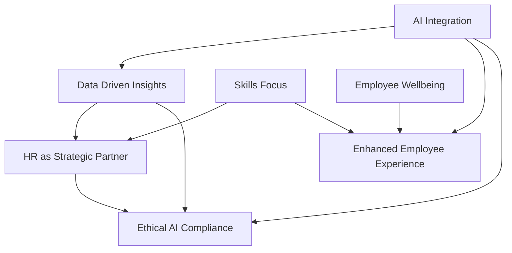

## HR's New Horizon: Navigating AI, Skills, and Holistic Wellbeing in 2026

As of August 2026, Human Resources finds itself at an exhilarating crossroads, rapidly transforming from a back-office function to a pivotal strategic partner driving organizational success. The "actual live news" in HR trends points to a dynamic interplay between advanced technology, evolving workforce demands, and a profound emphasis on the human element.

At the forefront is the **pervasive integration of Artificial Intelligence (AI)** into virtually every facet of HR. From automating routine tasks and enhancing recruitment to powering predictive analytics for workforce planning, AI is no longer a futuristic concept but a present-day reality. This includes the rise of "agentic AI," capable of executing multi-step tasks and making decisions with minimal human intervention. This shift necessitates robust AI governance frameworks and a crucial alliance between HR and IT to ensure ethical, compliant, and effective deployment. HR's role is evolving to oversee these intelligent systems, focusing more on strategic talent leadership and crafting personalized employee experiences.

Hand-in-hand with AI is the **accelerated shift towards a skills-based workforce model**. The traditional reliance on job titles and degrees is giving way to an emphasis on specific competencies and adaptable skills. Organizations are actively assessing their skills inventories, investing heavily in reskilling and upskilling programs to close critical talent gaps, and enabling greater internal mobility. This "skills-first" revolution is unlocking agility and future-proofing talent strategies in a rapidly changing work landscape.

Finally, **holistic employee wellbeing and an enhanced employee experience** remain paramount. Burnout is recognized as a board-level risk, prompting HR to implement proactive, data-driven approaches to psychological health and overall employee support. Wellbeing is no longer a peripheral program but a fundamental component of organizational infrastructure, influencing work design, leadership styles, and team resilience. Technology plays a key role in delivering seamless, personalized employee experiences, from automated onboarding to continuous performance and wellness management.

These trends underscore a clear message: HR in 2026 is about blending technological advancement with fairness, trust, and human judgment. It's about leveraging data to make informed decisions while nurturing a resilient, agile, and human-centric workforce in an era of continuous change.

