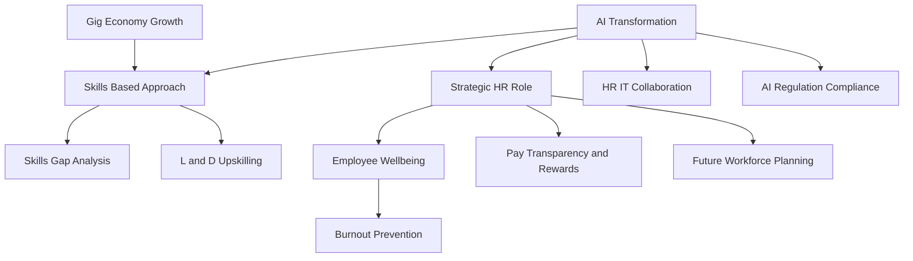

## HR in Mid-2026: Navigating AI, Skills, and Holistic Well-being

As we move through August 2026, the human resources landscape continues its rapid evolution, driven by technological advancements and shifting employee expectations. HR is no longer a mere administrative function; it's a strategic imperative, guiding organizations through continuous change. Here’s a concise look at the live news in HR trends right now.

**AI's Ascendancy and the Skills Revolution**
Artificial Intelligence (AI) is undeniably the most significant disruptor and enabler in HR. We're witnessing a profound transformation as AI reshapes recruitment, employee experience, and strategic decision-making. "Agentic AI" is emerging, capable of independently planning and executing multi-step HR workflows, leading to automation of hundreds of traditional processes and freeing HR professionals for more strategic work. This isn't about job replacement as much as task replacement, often driving workforce growth by enhancing productivity and creating new roles.

This AI-driven shift is accelerating the move towards **skills-based hiring**. Organizations are increasingly prioritizing capabilities over traditional credentials, with a significant majority adopting skills-first recruitment models. The challenge now lies in verifying these skills, as AI tools make it easier for candidates to exaggerate abilities, necessitating robust assessment processes. Identifying and closing skills gaps has become a continuous, strategic function, powered by AI-driven platforms and real-time data to build agile, future-ready teams.

**Well-being as Organizational Infrastructure**
Employee well-being has transitioned from a fringe benefit to a core organizational infrastructure. Mental health and burnout, once considered individual issues, are now recognized as board-level risks directly impacting productivity and performance. Employers are expanding their offerings to include holistic well-being ecosystems, encompassing mental health coaching, dedicated mental fitness days, and robust Employee Assistance Programs (EAPs). HR leaders are embedding well-being into work design, leadership practices, and overall team resilience.

**HR's Strategic Mandate and Evolving Workforce Dynamics**
HR is firmly established as a strategic partner, balancing business resilience with people needs across dynamic global markets. This strategic shift demands closer collaboration between HR and IT, especially as complex, AI-driven technologies are deployed across the workforce. Pay transparency is also gaining traction, becoming a critical differentiator for attracting and retaining talent by fostering trust and clarity.

The gig economy continues its robust growth, with freelancers and independent contractors expected to form the majority of the workforce in some regions by 2027. This trend necessitates adaptable recruitment strategies from employers. Meanwhile, the increasing integration of AI is also bringing a heightened focus on compliance, with new regulations emerging to govern AI's use in employment decisions.

The current HR landscape emphasizes agility, human-centered technology, and a proactive approach to talent development and well-being. Success hinges on blending technological advancement with fairness, trust, and human judgment.

