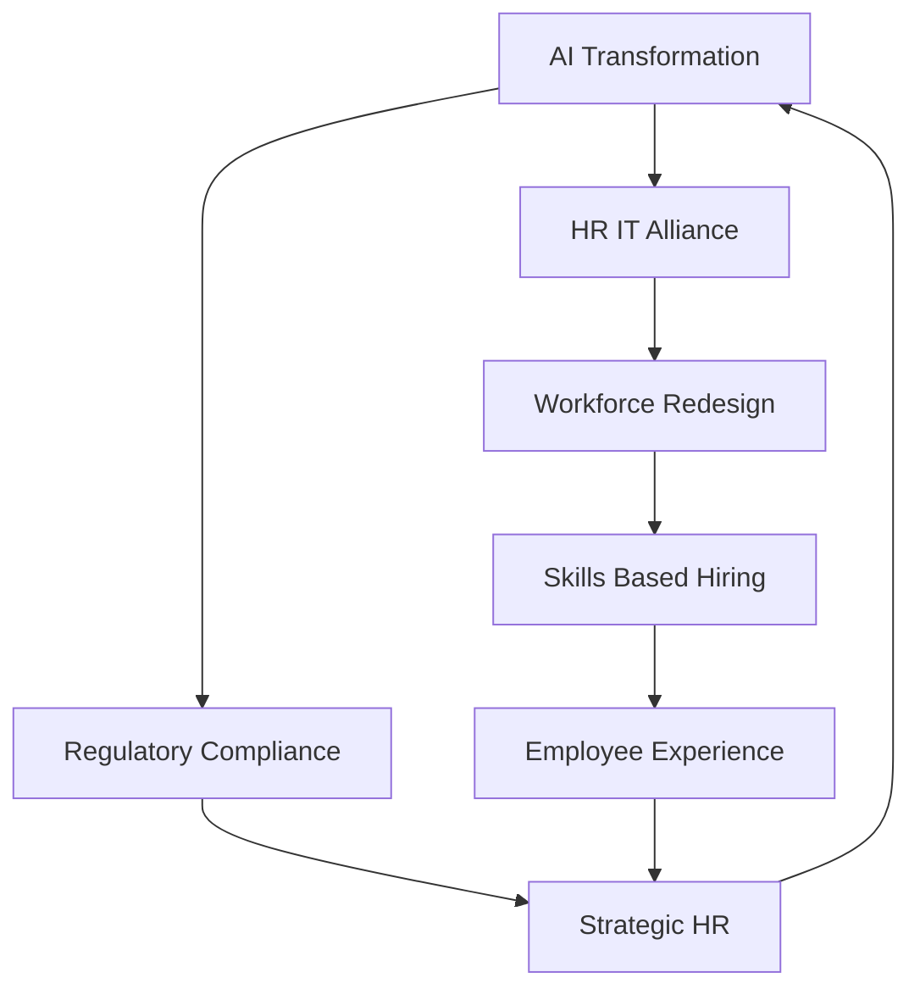

## Navigating the Human-Machine Era: Top HR Trends for August 2026

As of August 2026, the landscape of Human Resources continues its rapid evolution, driven primarily by technological advancements, shifting workforce dynamics, and an increasingly complex regulatory environment. HR is no longer a back-office function but a strategic partner crucial for organizational resilience and competitiveness.

One of the most defining trends is the pervasive integration of **Artificial Intelligence (AI)** into HR operations. Agentic AI, in particular, is redefining roles and expectations, moving beyond mere productivity tools to become a workforce disruptor. AI is automating routine tasks like screening, scheduling, and paperwork, freeing HR professionals to focus on strategic talent leadership and custom employee experiences. However, this surge in AI adoption necessitates a critical **HR and IT Alliance** to manage complex, AI-driven technologies and ensure data readiness and security.

Accompanying the rise of AI is a significant shift towards **Skills-Based Hiring and Workforce Redesign**. Organizations are increasingly prioritizing capabilities over traditional credentials, with 81% of employers having adopted skills-based hiring by early 2026. This involves decomposing roles into tasks and thoughtfully re-bundling work between humans and machines, aiming to develop "now-next" talent strategies for a blended workforce. Upskilling and reskilling initiatives are paramount to prepare employees for evolving job requirements.

**Employee Experience and Well-being** remain central to HR strategies. With workplaces embracing technology, the focus is also on fostering a human-centered approach, addressing mental health challenges, and mitigating employee burnout. The goal is to balance performance with purpose, designing environments that support human potential amidst digital transformation.

Finally, the **Regulatory Landscape** is continuously reshaping HR practices, particularly concerning AI in employment decisions and Diversity, Equity, and Inclusion (DEI) initiatives. Countries are actively regulating the use of AI, and HR leaders must navigate evolving compliance changes. For example, as of August 2026, the enforcement and interpretation around I&D practices continue to evolve, with companies grappling with strict guidelines and some shifting to a performance-based approach to I&D as a business advantage.

Here's how these key trends interlink:

