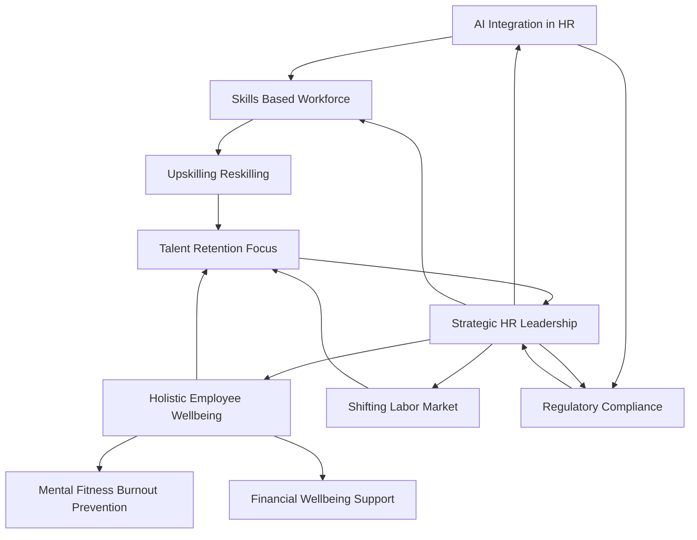

## HR Navigates a Dynamic Landscape: Mid-2026 Trends You Need to Know

As of August 2026, the human resources landscape continues its rapid evolution, shaped by technological advancements, economic shifts, and an unwavering focus on the human element of the workforce. HR leaders are at the forefront, balancing innovation with empathy to drive organizational success.

**AI Integration Reshaping Every Corner of HR**
Artificial intelligence is no longer a futuristic concept but a present reality, fundamentally redefining roles and expectations across HR. Organizations are actively deploying AI for tasks ranging from administrative automation and personalized employee experiences to predictive workforce planning. This rapid adoption, however, highlights a significant skills gap within HR itself, with AI and automation proficiency being the largest reported deficiency. The challenge for HR is not *if* to use AI, but *how* to use it effectively and ethically, ensuring human oversight and maintaining trust.

**Holistic Wellbeing Becomes Core Infrastructure**
The conversation around employee wellbeing has matured, moving beyond basic benefits to an integrated "organizational infrastructure" approach. "Mental fitness" is replacing traditional mental health awareness, emphasizing proactive resilience building and burnout prevention. Financial wellbeing is also a critical component, with employers recognizing its direct link to employee stress and overall productivity amidst economic uncertainties. Inclusive wellbeing programs are also on the rise, acknowledging that different employees require varied support.

**The Imperative of a Skills-Based Workforce**
With AI redefining job functions, a skills-based approach to workforce planning and development has become a strategic necessity. HR is intensifying efforts in skills gap analysis, upskilling, and reskilling to ensure agility and long-term resilience. This shift allows organizations to adapt flexibly to change while providing employees clear pathways for growth within the company.

**Navigating a Choppy Labor Market**
Recent data from July 2026 indicates a noticeable slowdown in the U.S. labor market. Nonfarm payrolls declined by 23,000 jobs, and previous months' job gains were revised downwards, signaling a wider slowdown than initially reported. While private employers saw a slight increase in jobs, overall momentum has slowed. The unemployment rate dipped, but this was attributed to a shrinking labor force rather than robust hiring. This turbulence puts a renewed focus on employee retention, which remains a top challenge for HR leaders.

**Compliance and Ethical Considerations**
As technology advances and societal expectations evolve, compliance obligations are expanding. HR must navigate new regulations concerning AI in employment decisions and evolving interpretations of inclusion and diversity practices. The convergence of culture and compliance means that how policies are applied directly impacts trust and organizational culture.

The HR function in mid-2026 is truly strategic, requiring agility, foresight, and a blend of technological savvy with a deeply human-centric approach to lead organizations through ongoing transformation.

