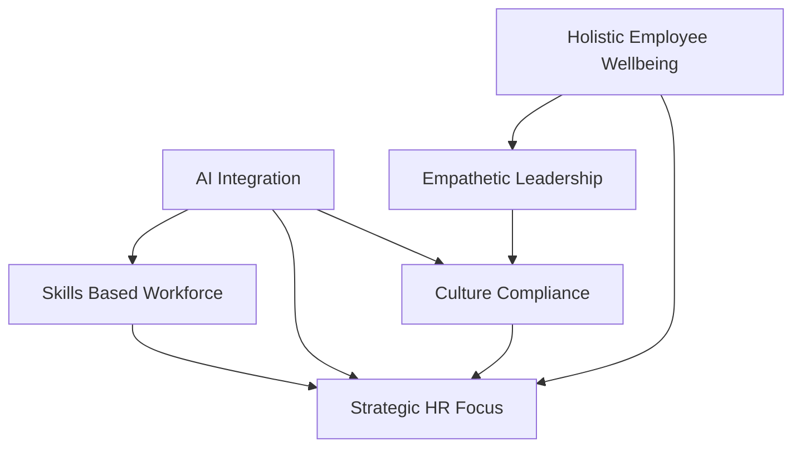

## HR's New Horizon: Decoding the Live Trends of 2026

August 9, 2026 – The world of work continues its rapid evolution, placing HR at the very heart of organizational strategy. Today, we're looking at the actual live news shaping human resources, moving beyond theory to the tangible shifts defining success in 2026.

**1. AI as Invisible Infrastructure, Not Just a Tool.**
Artificial Intelligence is no longer just a buzzword; it's becoming the invisible infrastructure that underpins many HR functions. Expect AI to be deeply embedded, streamlining processes from talent acquisition to performance management and workforce planning. In fact, 46% of organizations anticipate using AI in HR functions this year. This shift is less about replacing humans and more about redefining roles, with AI being 5.7 times more likely to shift job responsibilities and three times more likely to create new roles than to displace jobs. The imperative for HR is to take on governance and ethical oversight, ensuring responsible deployment.

**2. The Ascendancy of the Skills-Based Workforce.**
The traditional reliance on degrees is giving way to a laser focus on skills and capabilities. Organizations are increasingly adopting skills-based hiring and internal mobility strategies to build agile workforces that can adapt to rapid change. This means continuous upskilling and reskilling programs are becoming a core strategic priority, directly linking talent development to business needs and long-term resilience.

**3. Holistic Wellbeing Becomes Organizational Infrastructure.**
Employee wellbeing has matured beyond a perk; it's now a critical component of organizational infrastructure. This encompasses robust mental health support, financial wellness programs, flexible fitness benefits, and leave policies that genuinely reflect wellness values. HR leaders are also proactively addressing emerging concerns like AI-driven workforce anxiety, recognizing that a holistic approach to employee health is vital for sustained performance.

**4. Culture and Compliance Converge.**
Compliance is no longer a back-office function; it directly shapes organizational culture and trust. Decisions around pay transparency, leave policies, and AI oversight are highly visible and impact employee perceptions in real-time. Regulatory changes are the new normal, demanding that HR build compliance strategies that go beyond policy manuals and foster a culture of integrity and transparency.

**5. Empathetic Leadership in a Digital Age.**
As AI automates routine tasks, the demand for human-centric skills in leadership is surging. Empathetic leadership, emotional intelligence, adaptability, and clear communication are more critical than ever to navigate uncertainty and foster connection in hybrid and digitally augmented workplaces. HR is playing a pivotal role in developing leaders who can inspire trust and guide their teams through constant change.

These trends underscore a powerful message: HR in 2026 is a strategic architect, balancing technological innovation with profound human understanding to build resilient, agile, and purposeful workplaces.

