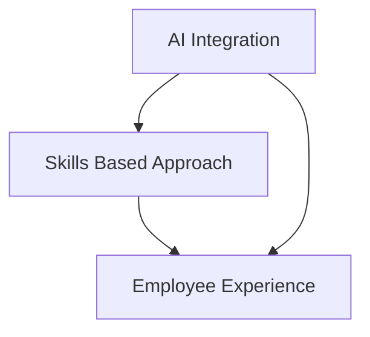

## Navigating 2026: The Evolving Landscape of HR Trends

As we move further into 2026, the Human Resources landscape is experiencing a dynamic transformation, driven primarily by technological advancements, evolving workforce expectations, and a renewed focus on human-centric strategies. HR leaders are pivoting from administrative roles to becoming strategic partners, adapting to a future where agility and foresight are paramount.

**AI's Pervasive Influence Reshaping Work**
Artificial Intelligence continues to be a dominant force, fundamentally altering how work is done and redefining the skills required across industries. HR is at the forefront of this shift, tasked with ensuring employee AI adoption and proficiency, and even integrating "agentic AI" into Human Capital Management (HCM) capabilities. This includes creating comprehensive AI enablement strategies, identifying AI champions, and providing hands-on experimentation. Organizations are increasingly looking to leverage AI to automate and streamline HR processes, moving towards AI-driven HR transformation. However, this rapid adoption also necessitates strong guardrails and ethical considerations, especially concerning AI's use in employment decisions.

**The Rise of Skills-Based Everything**
A significant paradigm shift is underway, with HR prioritizing a skills-based approach over traditional job titles. This means focusing on capabilities rather than credentials, recognizing that roles evolve faster than traditional education systems. Organizations are actively assessing their skills inventories, implementing skills-first recruitment, and developing robust upskilling and reskilling programs to address existing skill gaps. This strategic move helps build more agile workforces and connect technology to measurable business outcomes.

**Elevating Employee Experience and Wellbeing**
Amid technological shifts, the human element remains critical. Enhancing the employee experience and engagement is a top strategic priority for HR in 2026. This encompasses a rising expectation around wellbeing, with total rewards becoming an engine for clarity, consistency, and trust. Furthermore, fostering psychological safety is being recognized as essential to unlock the full potential of AI transformation and mitigate concerns like AI-driven burnout. Modern HR teams are focusing on creating a culture of respect, trust, and strong management skills to prevent issues and ensure employee satisfaction.

As HR continues its evolution into a more technical and strategic role, success will hinge on a delicate balance: blending technological advancement with fairness, trust, and human-centered decision-making.

