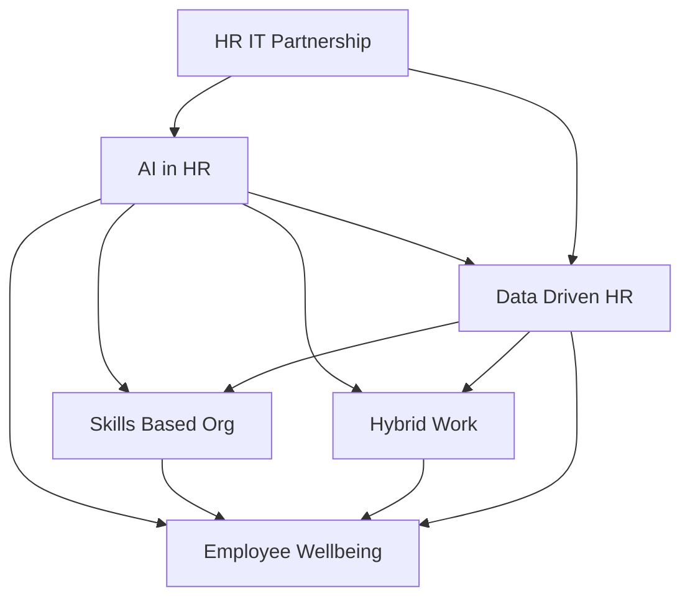

## The Pulse of People: August 2026 HR Trends You Need to Know

As August 2026 unfolds, the HR landscape continues its rapid evolution, driven by technological leaps, shifting workforce expectations, and a renewed focus on human-centric strategies. The "future of work" isn't a distant concept; it's the lived reality, demanding agility and foresight from HR leaders worldwide. Here’s a concise look at the actual live news shaping HR right now.

### Agentic AI Becomes the HR Backbone

Artificial Intelligence, particularly agentic and generative AI, is no longer just a feature but a fundamental layer across Human Capital Management (HCM) systems. This advanced AI can execute multi-step tasks, automate workflows from onboarding to payroll, and even influence high-stakes talent decisions, expanding job roles rather than solely automating them. The integration of AI is driving personalized employee experiences and powering AI coaching platforms. With this widespread adoption, strong AI governance and responsible deployment are becoming practical and essential requirements for HR teams.

### The Rise of the Skills-Based Organization

The traditional focus on job titles and degrees is rapidly giving way to a skills-first approach. In 2026, many organizations are actively assessing, mapping, and deploying talent based on specific capabilities rather than rigid roles. This shift is critical for addressing skill gaps, enhancing workforce agility, and fostering stronger internal talent mobility, which in turn expands the talent pool and improves retention. Research in early 2026 indicated that 81% of employers are already using skills-based hiring, with 46% planning further expansion.

### Holistic Employee Well-being as a Strategic Imperative

Employee well-being has moved beyond a perk to a strategic priority, intrinsically linked to business outcomes. Current trends emphasize personalized well-being programs that address mental, emotional, and financial health. Employers are focusing on preventative health, offering support for stress management, sleep, nutrition, and resilience training. Structured support for hybrid and remote employee well-being is also gaining traction, recognizing the unique challenges of flexible work models.

### Optimizing the Evolving Hybrid Work Model

Hybrid work is not fading but continuing to evolve, with organizations refining policies and technologies to create equitable and productive environments. Key initiatives include designing offices for collaboration rather than daily attendance, establishing clear communication expectations across distributed teams, and implementing hybrid meeting protocols to ensure all voices are heard. Technology plays a crucial role in seamless workspace coordination, including real-time desk booking platforms.

### HR-IT Partnership and Data-Driven Decisions

The increasing complexity of HR technology, especially with AI integration, mandates a tighter collaboration between HR and IT departments. This partnership is vital for modernizing data environments, ensuring strong governance, and facilitating the digital transformation of HR. Workforce and people analytics are also shifting from mere reporting to providing actionable insights that support strategic decision-making, helping HR leaders navigate talent shortages and manage workforce costs effectively.

The HR function in mid-2026 is at the forefront of orchestrating a more intelligent, agile, and human-centric workplace. Navigating these trends successfully requires a blend of technological adoption, strategic foresight, and a deep understanding of evolving human needs.

