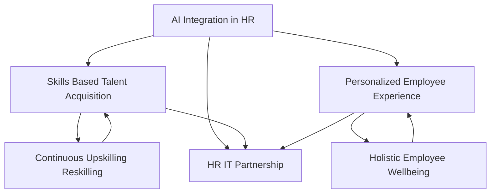

## August 2026: Navigating the New HR Frontier with AI, Skills, and Holistic Wellbeing

As of August 2026, the human resources landscape continues its rapid evolution, fundamentally reshaping how organizations attract, develop, and retain talent. HR leaders are at the forefront of integrating cutting-edge technology with a deepened focus on the human experience, driving strategies that are agile, intelligent, and empathetic. The "live news" in HR isn't just about adapting to change, but proactively shaping a future where technology amplifies human potential.

One of the most impactful trends is the **pervasive integration of Artificial Intelligence in HR**. We are moving beyond basic automation to the adoption of "Agentic AI," which can understand context, interpret goals, and execute complex tasks across recruitment, employee experience, and strategic decision-making. This isn't about replacing HR professionals but relieving administrative burdens, allowing teams to focus on higher-value, strategic work. However, this rapid adoption also brings a focus on increased regulation of AI in employment decisions and a critical need for HR-IT collaboration to ensure ethical implementation and effective oversight.

Hand-in-hand with AI is the surging dominance of **Skills Based Talent Acquisition and Development**. The traditional emphasis on degrees and past job titles is giving way to a focus on demonstrable competencies and future potential. By August 2026, a significant majority of employers are utilizing skills-based hiring to widen talent pools, reduce bias, and build more agile workforces. This shift extends beyond hiring, driving continuous upskilling and reskilling initiatives to ensure employees possess critical future-ready skills like data literacy, AI readiness, and adaptive problem-solving.

Finally, **Holistic Employee Wellbeing** remains a paramount concern, evolving beyond perks to a comprehensive, personalized approach. The conversation around mental health has matured into "mental fitness," emphasizing proactive resilience building and emotional strength. Organizations are prioritizing personalized wellbeing programs, structured support for hybrid and remote work, and addressing financial wellness as a key component of overall employee stability. Social connection is even being measured as a key performance indicator, recognizing its impact on productivity and health.

These trends are deeply interconnected, forming a dynamic ecosystem where technological advancement and human-centric strategies mutually reinforce each other. HR's strategic role in August 2026 is to deftly navigate this complex landscape, balancing innovation with empathy to create thriving, resilient workplaces.

Here's how these trends interlace:

