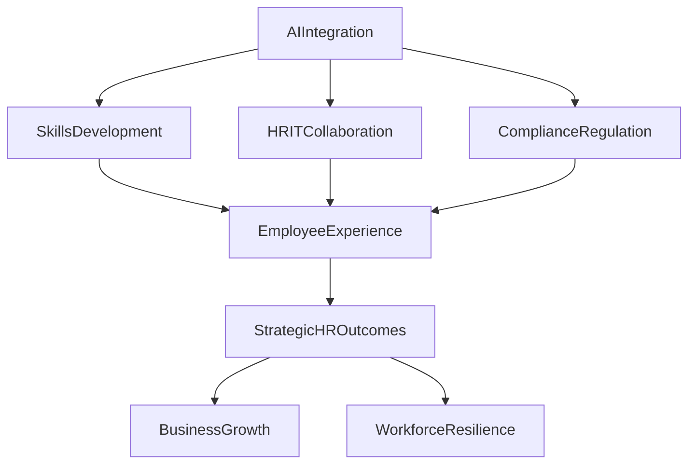

**HR Trends: Navigating 2026's Evolving Landscape**

As of August 28, 2026, the HR landscape continues its rapid transformation, dominated by technological advancements and a renewed focus on the human element. Organizations are grappling with how to effectively integrate sophisticated tools while nurturing their most valuable asset: their people.

Artificial intelligence stands as the undisputed centerpiece of current HR news. "Agentic AI is emerging as a core HCM capability," driving efficiency in recruitment, onboarding, and even performance management. However, this isn't merely about automation; AI is increasingly "expanding jobs instead of simply automating them," creating new roles that require different skill sets. A critical challenge currently facing HR is the readiness of managers to lead an "AI-fluent workforce," with many still struggling to understand AI's risks and fully leverage its potential. Congress and various countries are actively regulating the use of AI in employment decisions, adding a layer of compliance complexity for HR professionals.

Amidst this technological surge, the human experience remains paramount. The shift from a job-centric to a "skills-based work paradigm" is gaining momentum, demanding continuous upskilling and reskilling initiatives to close critical talent gaps. Employee wellbeing is no longer a perk but "organizational infrastructure," influencing work design, leadership styles, and team resilience. Empathetic leadership is crucial in this digital era, as HR aims to balance technological advancement with fairness, trust, and human judgment.

HR's strategic partnership with IT is deepening to navigate complex, AI-driven technologies. Furthermore, compliance with evolving employment laws, including new tax treatments for wages and benefits, flexible working rights, and AI regulations, demands constant vigilance. These interconnected trends highlight HR's pivotal role in shaping resilient, future-ready workplaces by integrating technology responsibly and prioritizing people.

