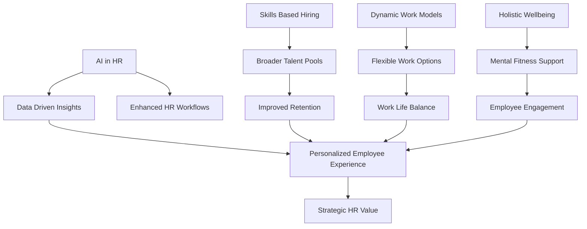

## HR Trends Live: Navigating the Evolving Workplace in August 2026

As August 2026 draws to a close, the Human Resources landscape continues its rapid evolution, driven by technological advancements, shifting employee expectations, and a profound focus on human-centric strategies. Far from static, HR is at the forefront of shaping the modern workplace.

### Key Trends Dominating HR Right Now:

1.  **AI's Maturation into HR's Strategic Partner:** Artificial Intelligence is no longer just a futuristic concept for HR; it's a practical, integral tool. In 2026, AI is moving beyond basic automation, with research suggesting that AI assistants are maturing into "superagents" capable of running end-to-end HR workflows, from recruiting to coaching and workforce management. While AI adoption is driving workforce growth by replacing tasks rather than people, managers face the challenge of leading an AI-fluent workforce, and organizations are grappling with tracking AI spending and ensuring ethical governance. Notably, AI is also emerging as a tool for greater workplace accessibility.

2.  **The Rise and Refinement of Skills-Based Hiring:** The traditional resume is taking a back seat as skills-based hiring becomes the standard rather than the exception. Employers are increasingly evaluating candidates based on demonstrable abilities, competencies, and real-world experience, rather than solely on degrees or job titles. This shift is expanding talent pools, improving hiring outcomes, and notably leading to higher retention rates for professional services firms. However, "Skillfishing"—candidates exaggerating abilities, often aided by AI—presents a challenge to accurate assessment.

3.  **Dynamic Work Models as the Default:** Hybrid work has solidified its position as the dominant operating model in 2026, favored by a significant majority of organizations and employees alike. The conversation has shifted from *where* we work to *how* we maintain connection and productivity. Companies are continually refining strategies to foster culture and engagement across distributed teams, acknowledging that flexible arrangements contribute to higher employee happiness and retention.

4.  **Holistic Employee Well-being Takes Center Stage:** Employee well-being has transitioned from a perk to a core business strategy. In 2026, this encompasses mental fitness (focusing on resilience and emotional strength), physical health, financial wellness, and even social connection, especially in dispersed teams. Organizations are prioritizing personalized well-being programs that are built with, not just for, employees, recognizing that one-size-fits-all solutions are fading.

These evolving trends underscore HR's strategic importance in cultivating a resilient, engaged, and skilled workforce ready for the challenges and opportunities of late 2026 and beyond.

