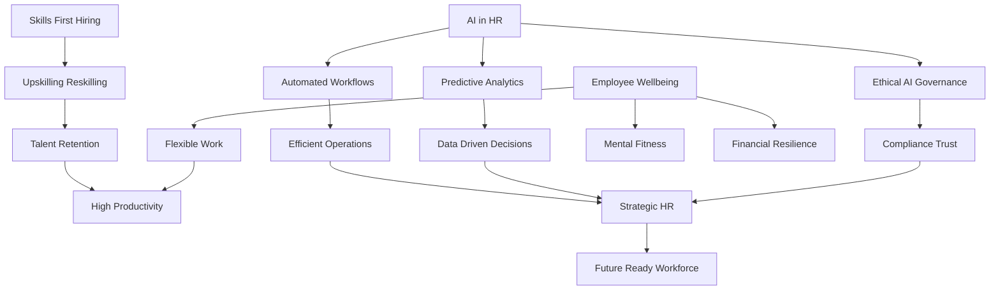

## HR in Motion: Navigating the Live Trends of September 2026

As of September 2026, the human resources landscape is a vibrant nexus of technological advancement, evolving employee expectations, and a profound strategic recalibration. HR is no longer merely a support function; it's a critical architect of the future workforce. Here are some of the most impactful live trends shaping HR today.

### AI Integration and Ethical Governance Take Center Stage

Artificial intelligence is no longer a futuristic concept but a present-day reality actively reshaping HR workflows. "Agentic AI" is leading this charge, moving beyond simple suggestions to autonomously manage complex, multi-step HR tasks such as onboarding, payroll processing, and generating insightful data. In talent acquisition, AI streamlines applicant screening and accelerates the hiring process, though human judgment remains indispensable for fostering trust and genuine connections with candidates. The widespread adoption of predictive people analytics is also transforming how organizations understand their workforce, shifting from periodic surveys to continuous, real-time insights. This rapid integration mandates robust ethical AI governance, with bias auditing and compliance now non-negotiable requirements, and new regulations continuously emerging. HR leaders are stepping into crucial roles, guiding AI strategy and actively managing its risks, recognizing that AI primarily reshapes and augments roles, driving upskilling rather than widespread job displacement.

### The Skills-First Revolution Reshapes Talent Strategies

The paradigm in talent acquisition has fundamentally shifted from traditional credentials to a precise focus on critical skills that directly contribute to organizational growth and transformation. With the "half-life" of skills shrinking to roughly two years, continuous learning and targeted upskilling initiatives are no longer optional perks but vital retention strategies, often personalized and delivered through AI-powered platforms. This skills-centric approach also extends to internal mobility, where assessing and developing existing employee capabilities for new roles is gaining significant traction.

### Holistic Well-being Becomes a Core Business Imperative

Employee well-being has firmly transitioned from being a mere benefit to a core business strategy, directly influencing productivity, retention, and overall organizational resilience. The dialogue has expanded beyond simply "mental health" to "mental fitness," emphasizing proactive measures for building resilience and emotional strength before crises arise. Comprehensive well-being programs increasingly include dedicated support for women's health (covering fertility, maternity, and menopause) and initiatives to build financial resilience amidst ongoing economic uncertainties. Flexible work arrangements and designated mental health days are now considered expected standards by employees.

The overarching theme for HR in September 2026 is its evolution into a deeply strategic partner, often termed an "AI Architect," working hand-in-hand with IT to navigate technological advancements and evolving human needs. This pivotal role demands adaptability, guiding organizations through continuous change while balancing people-centric approaches with business resilience.

