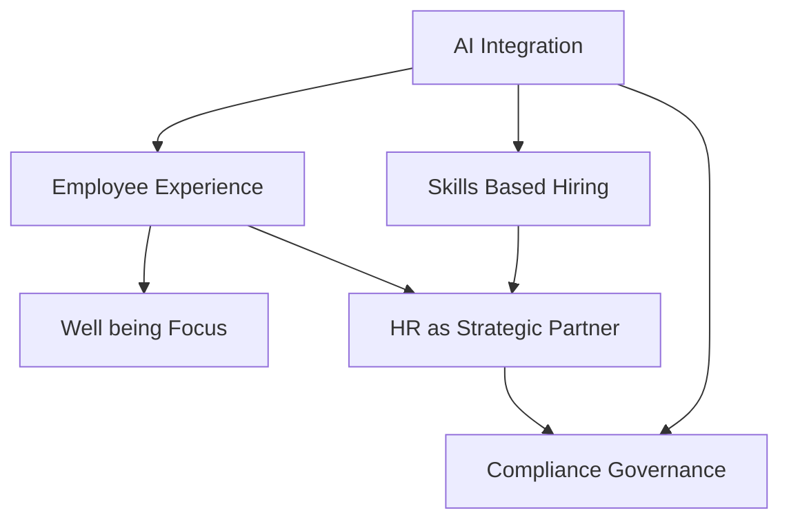

## HR's Shifting Tides: Navigating the 2026 Landscape

As of September 2026, the world of Human Resources is undergoing a rapid transformation, moving beyond traditional administrative tasks to become a truly strategic force within organizations. Driven by technological advancements, evolving workforce expectations, and a renewed focus on human capital, several key trends are defining the "live news" in HR.

**1. The Rise of Agentic AI and Smart Automation**.
Artificial Intelligence is no longer just a futuristic concept; it's the backbone of modern HR. Agentic AI, capable of independent planning and action, is automating multi-step workflows, generating insights, and supporting critical decision-making across the employee lifecycle, from recruitment to talent management. This shift demands strong AI governance and tighter collaboration between HR and IT departments to ensure ethical and effective deployment.

**2. Skills-Based Talent Strategies Take Center Stage**.
The focus is firmly shifting from traditional job titles to a skills-based approach in hiring, development, and workforce planning. Organizations are prioritizing what people *can do* over their resume, actively identifying and closing skills gaps through continuous learning and internal mobility programs. This flexible approach helps build a more agile and resilient workforce.

**3. Elevating the Employee Experience and Well-being**.
Employee experience (EX) has become a top priority, seen as the connective tissue across all workplace interactions. Holistic well-being, including mental health support, is no longer a perk but a fundamental expectation and organizational infrastructure. Continuous feedback and personalized experiences, often enabled by AI, are crucial for boosting engagement, which, according to Gallup's 2026 report, saw global levels drop to 20% in 2025.

**4. HR's Evolving Role as a Strategic Operator**.
HR is firmly entrenched as a strategic partner, moving beyond a support function to guide organizational evolution and business outcomes. HR leaders are now pathfinders, navigating complexity, driving change, and ensuring that people strategies align directly with business goals in a dynamic environment.

Here's a visual representation of these interconnected trends:

