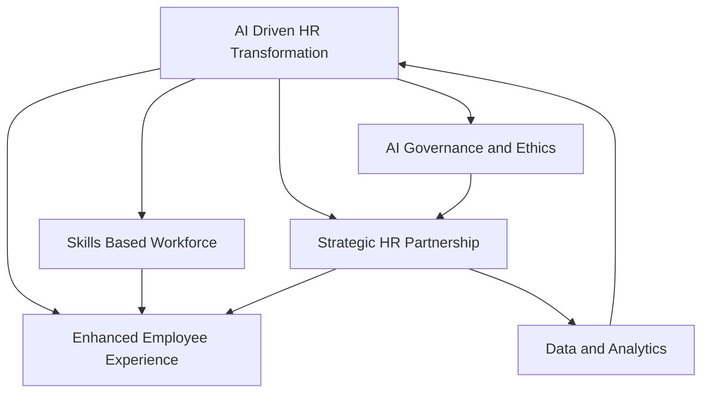

## Navigating 2026: Live HR Trends Reshaping the Workforce

As of September 2026, the world of Human Resources is in a period of dynamic transformation, moving beyond theoretical discussions to the practical implementation of groundbreaking strategies and technologies. The focus has sharpened on how HR can drive business value, foster a resilient workforce, and embrace intelligent automation while maintaining a human-centric approach.

**AI at the Core of HR Transformation.**
Artificial Intelligence is no longer an emerging concept but an operational imperative, with organizations shifting from experimentation to full-scale deployment. "Agentic AI," capable of executing multi-step tasks and automating workflows, is becoming central to Human Capital Management (HCM) systems, freeing HR teams for more strategic initiatives. This rapid integration demands "AI fluency" across the entire workforce, with companies like Shopify and BlackRock mandating AI literacy for both current and new hires. Consequently, robust AI governance and ethical frameworks are critical to protect investments and ensure fair, compliant practices.

**The Skills-First Revolution.**
The traditional reliance on job titles is rapidly being replaced by a "skills-based approach" to talent management. HR leaders are recognizing that skills are the fundamental building blocks of work, especially as AI reconfigures roles and accelerates "skills churn". This shift necessitates significant investment in upskilling and reskilling programs to prepare employees for evolving roles and to close critical capability gaps, ensuring the workforce remains agile and future-ready.

**HR as a Strategic Business Driver.**
HR's role has fundamentally evolved from a support function to a strategic operator, directly impacting organizational resilience and competitiveness. CHROs are prioritizing how HR can contribute to business growth, efficiency, and cultural integration. This strategic pivot is heavily supported by modern data environments and the increasing interdependence between HR and IT, driving a move towards connected, intelligent HR technology platforms that provide real-time insights and automated workflows.

**Elevating the Employee Experience and Well-being.**
A holistic approach to employee well-being is now recognized as organizational infrastructure, moving beyond a side note to a board-level risk. This includes fostering empathetic leadership, providing personalized learning and career pathing, and maintaining flexible work models as a permanent fixture. Furthermore, "pay transparency" is solidifying its position as a trust and talent differentiator, influenced by global directives like the EU Pay Transparency Directive. Performance management is also transforming into a continuous, real-time feedback process, enabled by HR technology.

The future of HR in 2026 is interconnected, demanding agility, foresight, and a deep understanding of how technology and human potential can converge to create thriving, high-performing organizations.

