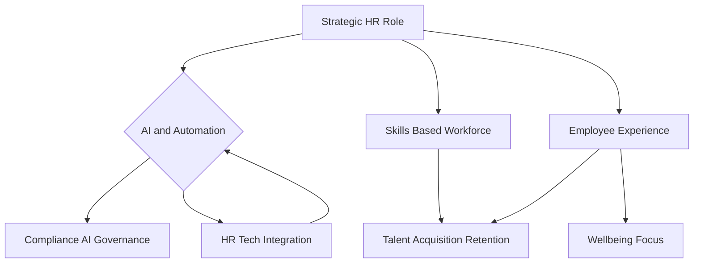

## HR in 2026: Navigating a Tech-Driven, People-Centric Landscape

**September 20, 2026** – The world of work continues its rapid transformation, with Human Resources at the forefront of driving strategic organizational success. As we stand in late 2026, several key trends are not just emerging but are actively reshaping how HR functions, connecting people strategy directly to business outcomes.

**The Rise of AI as HR's Backbone**
Artificial intelligence and automation are no longer futuristic concepts for HR; they are the foundational infrastructure. Agentic AI, in particular, is moving from a helpful feature to a core component of Human Capital Management (HCM) systems, automating routine tasks, generating insights, and supporting critical decision-making across the employee lifecycle. This shift allows HR professionals to focus on more strategic initiatives, leveraging data to understand trends like turnover and skill gaps. However, this widespread adoption necessitates robust AI governance and ethical practices to ensure responsible use and compliance with expanding regulations.

**Skills Over Titles: The New Workforce Paradigm**
The emphasis in talent management has decisively shifted from traditional job titles to a skills-based approach. Organizations are increasingly assessing their skills inventories, upskilling, and reskilling their workforces to close critical gaps and future-proof their capabilities. This focus ensures that companies can adapt to evolving business needs and foster continuous learning as an integral part of employee development and retention.

**Elevated Employee Experience and Wellbeing**
Employee experience and wellbeing have solidified their position as strategic imperatives. Beyond isolated programs, wellbeing is now recognized as a fundamental organizational infrastructure, directly influencing performance, retention, and leadership effectiveness. HR teams are focused on creating hyper-personalized employee experiences, enhancing engagement, and proactively addressing mental health, recognizing that these factors are crucial for attracting and retaining talent in a competitive market.

**HR as a Strategic Operator**
The HR function has fully transitioned from a support role to a strategic operator, guiding organizational evolution and contributing directly to business value. HR leaders are now pathfinders in a landscape of continuous disruption, making data-informed decisions, and connecting people strategies with overarching business goals. This requires tighter collaboration between HR and IT to effectively implement and manage complex, AI-driven technologies.

Here’s a snapshot of these interconnected trends:

The HR landscape in 2026 is dynamic, characterized by technological advancement, a deep commitment to employee welfare, and a strategic focus on skills-based development. Success hinges on HR's ability to balance innovation with ethical governance, ensuring a resilient, skilled, and supported workforce for the future.