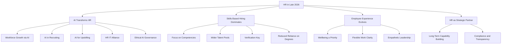

## HR in Motion: Top Trends Shaping the Workforce in Late 2026

As of September 22, 2026, the HR landscape is dynamically evolving, driven by technological advancements and a renewed focus on human-centric strategies. Organizations are grappling with a complex mix of innovation and enduring people challenges, pushing HR professionals to adopt more strategic, tech-savvy, and empathetic approaches.

**AI Integration: Beyond Automation, Towards Augmentation**
Artificial Intelligence (AI) continues to redefine HR, moving beyond simple automation to become a critical enabler of workforce growth and productivity. In 2026, AI is primarily replacing tasks, not people, with 62% of organizations expecting headcount growth this year due to AI-driven efficiencies. It's extensively used in recruiting, with an 81% utilization rate in AI-powered tools, delivering measurable returns quickly. AI also serves as a front-line assistant in daily people management, surfacing patterns for human review rather than replacing critical conversations. HR and IT functions are becoming increasingly interconnected to deploy and govern these complex, AI-driven technologies effectively. The ethical implications and the need for robust AI regulations in employment decisions are also paramount, requiring HR leaders to blend technological advancement with fairness and trust.

**Skills-Based Hiring: The New Standard for Talent Acquisition**
The shift to skills-based hiring has become the dominant recruiting approach in 2026, moving the focus from traditional credentials like degrees and years of experience to demonstrated abilities and competencies. This method helps organizations access wider talent pools and address persistent labor shortages. However, a new challenge has emerged: "skillfishing," where candidates exaggerate capabilities, making robust verification processes earlier in the hiring funnel crucial for success. Nearly 70% of employers now utilize skills-based hiring practices, recognizing its potential to predict job readiness more accurately.

**Evolving Employee Experience: Well-being and Flexible Work Clarity**
Employee well-being continues to be a top priority, with rising expectations and burnout recognized as a board-level risk. Organizations are focusing on enhancing the overall employee experience, engagement, and well-being as key HR priorities for 2026. Furthermore, flexible work models remain highly valued by employees, but the conversation has shifted from "remote-first" or "office-first" to defining clear, consistent expectations for flexibility tailored to unique workforces. Empathy and human judgment remain central to leadership, even as AI takes on routine tasks.

**HR as a Strategic Business Driver**
HR is increasingly seen as a strategic operator rather than merely a support function. The focus has moved towards long-term capability building, strategic alignment, and deeper collaboration with other departments like IT. Compliance with evolving regulations, particularly regarding AI in employment decisions, and increased payroll transparency are also critical areas of focus, reflecting HR's growing role in risk mitigation and trust-building.

The dynamic interplay of these trends highlights HR's pivotal role in navigating the future of work, ensuring that technological progress is balanced with human-centered strategies for organizational success.

